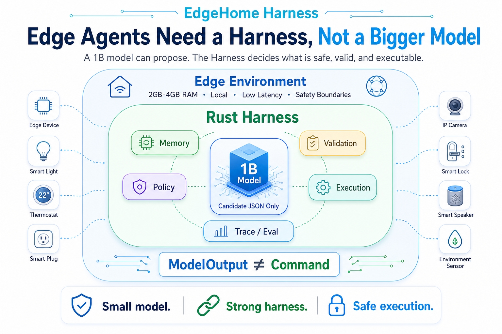
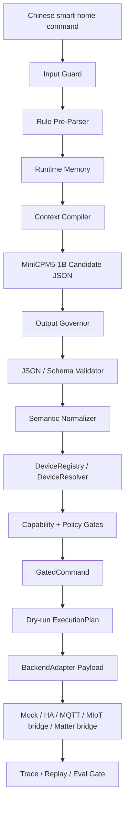

<div align="center">
  
  <h1>EdgeHome Harness</h1>
  <p><strong>A Rust safety harness for MiniCPM-powered edge home command agents.</strong></p>
  <p>
    <a href="https://github.com/yushui2022/EdgeHome-Harness/actions/workflows/ci.yml"></a>
    
    
    
    
    
  </p>
  <p>
    <a href="#quick-start">Quick Start</a> |
    <a href="#architecture">Architecture</a> |
    <a href="#command-contract">Command Contract</a> |
    <a href="#backend-support-matrix">Backends</a> |
    <a href="#customization-model">Customization</a> |
    <a href="#roadmap-and-governance">Roadmap</a>
  </p>
  <p><code>MiniCPM proposes.</code> <code>Rust decides.</code> <code>Adapters translate.</code></p>
</div>

<p align="center">
  
</p>

<p align="center">
  <em>Overview diagram. The current repository implements a dry-run execution
  boundary; real device execution is disabled by default.</em>
</p>

EdgeHome Harness keeps a small local MiniCPM-class model in a narrow, auditable
role: generate backend-neutral smart-home command candidates. Rust owns the
parts that must be deterministic: schema validation, device resolution, policy
gates, dry-run planning, traceability, evaluation, and backend payload
translation.

This is not a generic chatbot framework, a production smart-home gateway, a Mi
Home replacement, a Home Assistant replacement, or a smart speaker. It is a
reproducible engineering prototype for studying how a 1B local model can safely
enter a constrained command pipeline without being trusted as the executor.

## At A Glance

| Area | Current status |
| --- | --- |
| Target model profile | MiniCPM / MiniCPM5-class local 1B model |
| Model output | Backend-neutral candidate JSON |
| Rust validation and normalization | Implemented |
| Registry-based device resolution | Implemented |
| `GateEngine` / `GatedCommand` boundary | Implemented |
| Dry-run `ExecutionPlan` | Implemented |
| Mock adapter | Implemented |
| Home Assistant adapter | Gateway boundary with dry-run, opt-in execute, and route validation |
| MIoT / Xiaomi | Bridge request adapter implemented; real device support requires a private bridge |
| Matter | Bridge request adapter implemented; real control requires a Matter controller bridge |
| MQTT | Dry-run payload adapter and guarded publish executor implemented |
| Backend readiness check | Read-only CLI validation for HA / MQTT / MIoT bridge / Matter bridge routes |
| Real device execution | Explicit opt-in only; disabled by default |
| Execution evidence privacy | Backend responses are redacted and bounded before trace storage |
| Release eval gate | 108 mock cases across 12 categories |
| Public evidence bundle | Git-ignored report, JSON artifacts, SHA-256 manifest, schema, and standalone verifier |

## Why This Exists

Small local models are useful for narrow slot extraction, but they are not safe
execution authorities. They can omit fields, repeat, drift, produce malformed
JSON, or invent identifiers that look plausible.

EdgeHome Harness is built around one rule:

```text
ModelOutput != Command
```

MiniCPM may propose:

- intent
- room
- device alias
- device type
- action
- short parameters such as brightness, temperature, mode, or time condition

MiniCPM must not decide:

- real `device_id`
- Home Assistant `entity_id`
- MIoT `did / siid / piid / aiid`
- Matter node, endpoint, cluster, attribute, or command IDs
- MQTT topics or payload routes
- backend URLs, tokens, secrets, or execution switches
- risk level or safety policy

Those values come from Rust types, `DeviceRegistry`, capability rules, policy
configuration, adapter configuration, and explicit operator-controlled settings.

## Quick Start

Requirements:

- Rust `1.95` or newer.
- Optional: Ollama with `openbmb/minicpm5:1b` for real MiniCPM runs.

Show the default low-memory profile:

```powershell
cargo run -q -p edgehome-cli -- config show
```

Run a deterministic mock dry-run:

```powershell
cargo run -q -p edgehome-cli -- --db-path edgehome-demo.sqlite dry-run --mock "把客厅灯打开"
```

Expected shape:

```text
policy_decision = allow
dry_run_plan != null
backend = mock
trace_id is recorded
```

Run a denied safety case:

```powershell
cargo run -q -p edgehome-cli -- --db-path edgehome-demo.sqlite dry-run --mock "关闭燃气报警器"
```

Expected shape:

```text
policy_decision = deny
dry_run_plan = null
blocking_reasons includes PolicyGate denial
trace_id is recorded
```

Run the release eval gate:

```powershell
cargo run -q -p edgehome-cli -- --db-path edgehome-gate.sqlite eval cases/zh-home.yaml --gate
```

Run the full local release check:

```powershell
powershell -ExecutionPolicy Bypass -File scripts\release-check.ps1
```

Run the release check and generate a git-ignored public demo evidence smoke
bundle:

```powershell
powershell -ExecutionPolicy Bypass -File scripts\release-check.ps1 -WithDemoSmoke
```

Run the scripted demo:

```powershell
powershell -ExecutionPolicy Bypass -File scripts\demo.ps1 -DatabasePath edgehome-demo.sqlite -OutputDir artifacts\public-demo
```

The output directory is ignored by git and contains a Markdown report plus JSON
evidence for the release gate, dry-runs, trace export, memory examples, backend
readiness checks, OutputGovernor focused test, and a SHA-256 evidence manifest.
Verify an existing bundle with `scripts\verify-demo-evidence.ps1`.

Check backend routes and adapter configs without touching devices:

```powershell
cargo run -q -p edgehome-cli -- backend check --backend all
cargo run -q -p edgehome-cli -- backend check --backend home_assistant --registry configs/devices.home_assistant.example.yaml
cargo run -q -p edgehome-cli -- backend check --backend mqtt --registry configs/devices.mqtt.example.yaml
cargo run -q -p edgehome-cli -- backend check --backend miot --registry configs/devices.miot.example.yaml
cargo run -q -p edgehome-cli -- backend check --backend matter --registry configs/devices.matter.example.yaml
```

The check command is read-only. It validates registry routes, adapter config,
execution switches, and secret availability. It never calls Home Assistant,
publishes MQTT, or contacts MIoT/Matter bridges.

## Release Evidence Bundle

Public demos and release announcements should be backed by a generated evidence
bundle rather than screenshots or unchecked claims:

```powershell
powershell -ExecutionPolicy Bypass -File scripts\release-check.ps1 -WithDemoSmoke
```

The bundle is written under `artifacts\release-demo-smoke` and is ignored by
git. It contains:

- `public-demo-report.md` for the human-readable claim boundary.
- JSON evidence for the release gate, dry-runs, trace export, memory examples,
  backend readiness checks, and output-governor behavior.
- `12-evidence-manifest.json` with the current git commit, tracked dirty flag,
  file sizes, SHA-256 hashes, and the public claim boundary.
- A machine-readable manifest contract at
  [docs/schemas/demo-evidence-manifest.schema.json](docs/schemas/demo-evidence-manifest.schema.json).

Verify an existing bundle independently:

```powershell
powershell -ExecutionPolicy Bypass -File scripts\verify-demo-evidence.ps1 -EvidenceDir artifacts\release-demo-smoke
```

This evidence proves the covered harness pipeline, gates, trace/replay, eval
gate, and adapter readiness boundaries. It does not prove universal smart-home
support, real Xiaomi device validation, real Matter validation, or default-on
real-device execution.

## Example Pipeline

User input:

```text
晚上十点后把走廊灯调到30%
```

MiniCPM candidate JSON stays backend-neutral:

```json
{
  "intent": "control_device",
  "room": "hallway",
  "device_alias": "走廊灯",
  "device_type": "light",
  "action": "set_brightness",
  "params": {
    "brightness": 30,
    "time_after": "22:00"
  }
}
```

Rust resolves and gates the internal command:

```json
{
  "device_id": "hallway_light",
  "device_type": "light",
  "action": "set_brightness",
  "policy": "allow",
  "dry_run_ready": true
}
```

The Home Assistant demo adapter can then produce a service-call dry-run payload:

```json
{
  "backend": "home_assistant",
  "device_id": "hallway_light",
  "entity_id": "light.hallway",
  "service": "light.turn_on",
  "service_path": "/api/services/light/turn_on",
  "payload": {
    "entity_id": "light.hallway",
    "brightness_pct": 30
  },
  "condition": {
    "time_after": "22:00"
  }
}
```

`entity_id` is produced by the adapter from registry data. It is not emitted by
MiniCPM and is not part of the model prompt.

## Release Gate Snapshot

The current mock + low-memory release gate covers harness behavior and
regression safety:

| Metric | Current value |
| --- | ---: |
| Cases | 108 |
| Categories | 12 |
| Pass rate | 1.0 |
| Schema valid rate | 1.0 |
| Trace coverage | 1.0 |
| False allow rate | 0.0 |
| Fail-closed rate | 1.0 |
| Input guard flag accuracy | 1.0 |
| Retry rate | 0.0 |

Coverage categories:

```text
normal_control
slot_extraction
air_conditioner_controls
runtime_memory
long_memory
long_memory_rejected
high_risk_policy
fail_closed_safety
capability_boundary
unknown_device
input_guard
backend_boundary
```

This gate verifies covered harness regressions. It is not a broad
natural-language understanding benchmark, a production-readiness claim, or proof
of real-device deployment at scale.

Real MiniCPM/Ollama behavior is tracked separately in
[Real MiniCPM / Ollama Eval Report](docs/real-minicpm-eval-report.md). The
latest reviewed run completed 108 cases with 104 passing end-to-end,
full trace coverage, `false_allow_rate = 0.0`, and `fail_closed_rate = 1.0`.
It also used deterministic repair/fallback in 84 cases, so it is reported as
model+harness evidence, not as standalone MiniCPM parsing accuracy and not as
the deterministic release gate.

## Architecture



The model is deliberately kept near the top of the pipeline. Everything after
candidate generation is owned by the harness.

## Command Contract

| Layer | Type | Owner | Trust level |
| --- | --- | --- | --- |
| Candidate JSON | `ModelCandidate` | MiniCPM / Mock model | Untrusted |
| Internal command | `NormalizedCommand` | Rust parser and normalizer | Must be resolved and gated |
| Gated command | `GatedCommand` | `GateEngine` | Accepted internal command only |
| Verified dry-run plan | `ExecutionPlan` | `DryRunPlanner` | Trusted dry-run boundary |
| Backend payload | `DryRunPlan.payload` | `BackendAdapter` | Backend-specific dry-run output |

Canonical flow:

```text
User Chinese command
  -> MiniCPM candidate JSON
  -> Rust schema validation and semantic normalization
  -> Device registry / memory resolution
  -> Capability and policy gates
  -> GatedCommand
  -> ExecutionPlan
  -> BackendAdapter payload
```

## Backend Support Matrix

| Backend | Status | What works | What is not claimed |
| --- | --- | --- | --- |
| Mock | Implemented | Deterministic dry-run payloads and eval baseline | Real device control |
| Home Assistant | Gateway boundary implemented and locally verified | Service-call dry-run payloads; opt-in HTTP/HTTPS REST execution; route validation; optional post-state fetch; CLI execute path tested against a local HTTP fixture | Full HA replacement or universal HA coverage |
| MIoT / Xiaomi | Bridge request adapter implemented and locally verified | Verified commands become MIoT bridge requests; CLI execute path can call a configured private bridge with env or token-file secrets | Universal Xiaomi support, real Xiaomi hardware validation, or direct MIoT protocol ownership |
| Matter | Bridge request adapter implemented and locally verified | Verified commands become Matter controller bridge requests; CLI execute path can call a configured private bridge with env or token-file secrets | Embedded full Matter controller, fabric commissioning, real Matter hardware validation, or universal device support |
| MQTT | Dry-run and guarded publish implemented and locally verified | Configured topic/payload translation; opt-in `rumqttc` broker publish; CLI execute path tested against a local broker fixture | Universal MQTT smart-home schema or default real broker operation |

Unsupported backend targets must fail closed. They must not silently fall back
to mock payloads.

Use `cargo run -q -p edgehome-cli -- backend check ...` to validate backend
routes and config before producing dry-run evidence or enabling private real
execution.

## Implemented Scope

- Rust workspace with separated crates for core types, config, parser, registry,
  gate, memory, Ollama adapter, executor, storage, trace, eval, and CLI.
- MiniCPM5-1B oriented low-memory runtime profile.
- Mock model and mock executor path for deterministic demos and regression
  testing.
- Ollama structured-output request adapter.
- Output governor for overlong output, invalid JSON, dead-loop detection, retry
  policy, and fallback classification.
- Runtime memory for short-session references and confirmed long-term aliases.
- Device registry, registry-based resolution, and capability validation.
- Policy gate with fail-closed behavior.
- Typed `GatedCommand` boundary before dry-run planning.
- `BackendAdapter` trait with Mock, Home Assistant, MQTT, MIoT bridge, and
  Matter bridge payload adapters.
- Guarded MQTT publish executor and bridge executors for MIoT/Matter, all
  disabled by default.
- CLI `execute` integration tests for previously recorded dry-run traces across
  Mock, Home Assistant, MQTT, MIoT bridge, and Matter bridge paths.
- Home Assistant gateway boundary with route validation, token isolation, and
  optional post-state fetch after explicit execution.
- Redacted executor response evidence so backend tokens, private IDs, oversized
  payloads, and full Home Assistant attributes are not persisted in traces.
- Read-only backend readiness CLI for HA, MQTT, MIoT bridge, and Matter bridge
  route/config validation.
- SQLite-backed evidence, audit, trace, replay, and long-term memory.
- 108-case release eval gate across 12 categories.
- Low-memory pressure policy for context/output reduction and rule-only
  fallback.

## Not Claimed

- Replacement for a production smart-home platform.
- Replacement for Mi Home, Home Assistant, Matter, MQTT, or a smart speaker.
- Universal Xiaomi / MIoT device support.
- Embedded full Matter controller support.
- MQTT real broker publish by default.
- Long-running benchmark on a real 2GB ARM board.
- Proof that all smart-home natural-language inputs are understood.
- Real-device execution enabled by default.
- Model-generated vendor-ready JSON.

## Customization Model

The model output contract is fixed and safe. Customization happens below the
model:

- add devices and aliases in the device registry;
- define supported capabilities and value ranges;
- set risk levels and policy behavior;
- configure backend routes such as Home Assistant entity IDs, MQTT topics, MIoT
  bridge route IDs, or Matter bridge route IDs;
- add backend adapter mappings with tests.

Do not ask MiniCPM to emit a vendor's JSON format directly. Keep model JSON
canonical, then customize registry and adapter mappings.

Useful references:

- [Customization Contract](docs/customization.md)
- [Command Pipeline Contract](docs/command-pipeline-contract.md)
- [Backend Adapter Contract](docs/backend-adapter-contract.md)
- [Bridge API Contract](docs/bridge-api-contract.md)

## Running With MiniCPM Through Ollama

The mock path is for deterministic demos and release regression tests. To
exercise the real model path, start Ollama and make sure the configured model is
available:

```powershell
ollama pull openbmb/minicpm5:1b
ollama serve
```

Then run without `--mock`:

```powershell
cargo run -q -p edgehome-cli -- --db-path edgehome-ollama.sqlite dry-run "把客厅灯打开"
```

The Ollama response still goes through output governance, parser/schema
validation, registry checks, policy gates, dry-run planning, and trace
recording. Real MiniCPM evaluation should be reported separately from the mock
release gate, with model output, latency, retry, and fallback metrics.

For a reproducible real-model report workflow, see
[Real MiniCPM / Ollama Eval Report](docs/real-minicpm-eval-report.md).

## Low-Memory Profile

The default profile targets constrained edge environments:

```text
2GB-4GB RAM
local inference
short context
short JSON output
bounded memory injection
deterministic policy
traceable failure
```

The resource pressure policy can reduce `num_ctx` and `num_predict`. Under
critical pressure it can disable memory injection and switch to rule-only
fallback.

This is a design constraint, not a claim that a long-running real 2GB ARM board
benchmark has been completed.

See:

- [2GB RAM Profile](docs/2gb-profile.md)
- [2GB Memory Budget](docs/2gb-memory-budget.md)
- [Model Parameters](docs/model-parameters.md)

## Home Assistant Boundary

Home Assistant is implemented as a gateway boundary, not as the project itself
and not as a Home Assistant replacement.

The model never sees:

```text
Home Assistant token
entity_id
service path
backend route
private network URL
```

Device routing is owned by the registry and executor. Real execution remains
disabled by default and should only be enabled for explicit local testing after
dry-run, gate, and confirmation checks.

See:

- [Home Assistant Demo](docs/home-assistant-demo.md)
- [Deployment Modes](docs/deployment-modes.md)

## Explicit Execute

The CLI can execute a fresh, previously recorded dry-run trace, but only
through an explicit command:

```powershell
cargo run -q -p edgehome-cli -- --db-path edgehome-demo.sqlite execute <trace_id> --confirm --backend-config private/backend.yaml
```

The command does not parse fresh natural language. It loads the existing
`DryRunPlan` from trace evidence, rejects stale traces older than 600 seconds,
rejects trace IDs that have already completed real execution, applies
confirmation/risk checks, then calls the selected backend executor. Public
example configs keep `execute_enabled: false`, so real execution still fails
closed unless private backend config explicitly enables it. Private backend
secrets can be supplied by environment variables or token files outside the
repository. Executor responses are recorded as redacted evidence: Home
Assistant post-state stores a state summary instead of full attributes, MQTT
evidence omits broker credentials, and bridge backend responses are recursively
sanitized before trace storage.

Failed explicit execution attempts are also recorded as redacted executor
failure evidence plus a `real_execution_failed` audit event. A failed attempt
does not mark the trace as completed, so a fresh trace can be retried after the
private backend configuration is fixed.

## Documentation

- [WAIC One-Page](docs/waic-one-page.md)
- [Architecture V2](docs/architecture-v2.md)
- [Customization Contract](docs/customization.md)
- [Command Pipeline Contract](docs/command-pipeline-contract.md)
- [Backend Adapter Contract](docs/backend-adapter-contract.md)
- [Bridge API Contract](docs/bridge-api-contract.md)
- [Bridge JSON Schemas](docs/schemas/)
- [MQTT Guarded Publish](docs/mqtt-guarded-publish.md)
- [MIoT Bridge Adapter](docs/miot-bridge-adapter.md)
- [Matter Bridge Adapter](docs/matter-bridge-adapter.md)
- [Roadmap](docs/roadmap.md)
- [Release Checklist](docs/release-checklist.md)
- [Release Evidence](docs/release-evidence.md)
- [Real MiniCPM / Ollama Eval Report](docs/real-minicpm-eval-report.md)
- [Home Assistant Gateway Boundary](docs/home-assistant-gateway.md)
- [Home Assistant Golden Payloads](docs/home-assistant-golden-payloads.md)
- [Eval Report Example](docs/eval-report-example.md)
- [Demo Walkthrough](docs/demo-walkthrough.md)
- [2GB RAM Profile](docs/2gb-profile.md)

## Repository Layout

```text
crates/edgehome-core       core schemas and command types
crates/edgehome-config     runtime profiles and low-memory config loading
crates/edgehome-parser     input guard, JSON extraction, schema validation, normalizer
crates/edgehome-registry   device registry, alias resolution, capability checks
crates/edgehome-gate       deterministic policy and execution gates
crates/edgehome-memory     short-session memory and confirmed long-term memory
crates/edgehome-ollama     MiniCPM/Ollama adapter and output governor
crates/edgehome-executor   dry-run planner, executors, backend adapter boundaries
crates/edgehome-storage    SQLite-backed evidence storage
crates/edgehome-trace      trace, audit, replay frame types
crates/edgehome-eval       case loading, metrics, release gate
crates/edgehome-cli        command-line demo and eval runner

.github/                  CI, issue templates, and pull request template
cases/                     regression cases
configs/                   runtime and device configuration
docs/                      architecture, demo, deployment, and memory notes
scripts/                   demo, evidence, release, and embedded validation scripts
```

## Development Checks

```powershell
cargo fmt --all --check
cargo clippy --workspace --all-targets -- -D warnings
cargo test --workspace
cargo run -q -p edgehome-cli -- --db-path edgehome-gate.sqlite eval cases/zh-home.yaml --gate --summary
git diff --check
```

The same commands plus backend readiness checks and repository hygiene checks
are wrapped by `scripts\release-check.ps1`. Add `-WithDemoSmoke` when preparing
public demo material or a release announcement; it runs the same checks and
generates a git-ignored evidence bundle with a SHA-256 manifest under
`artifacts\release-demo-smoke`.

The same checks run in GitHub Actions for pushes and pull requests to `main`.

## Roadmap And Governance

- [Roadmap](docs/roadmap.md): current baseline, near-term work, adapter order,
  hardware evidence requirements, and non-goals.
- [Release Checklist](docs/release-checklist.md): commands, release gate
  thresholds, docs review, secrets review, and release-note requirements.
- [Public Release Baseline](docs/public-release-baseline.md): evidence-backed
  public baseline for GitHub releases, demos, WAIC material, and claim
  boundaries.
- [Release Evidence](docs/release-evidence.md): reproducible demo evidence
  command, artifact index, and claim boundary for public material.
- [Changelog](CHANGELOG.md): project-facing changes and public baseline.
- [Contributing](CONTRIBUTING.md): contribution workflow, boundary rules, eval
  case guidance, and adapter requirements.
- [Security Policy](SECURITY.md): private reporting guidance and examples of
  safety boundary issues.
- [Code of Conduct](CODE_OF_CONDUCT.md): discussion and community expectations.

## Positioning

EdgeHome Harness is not trying to make MiniCPM act like a large cloud agent. It
uses MiniCPM where a small local model is useful: converting natural language
into a compact candidate. Everything that must be reliable is moved back into
Rust.

```text
Small model.
Strong harness.
Fail-closed boundary.
```

## License

Licensed under either of:

- Apache License, Version 2.0 ([LICENSE-APACHE](LICENSE-APACHE))
- MIT license ([LICENSE-MIT](LICENSE-MIT))

at your option.
