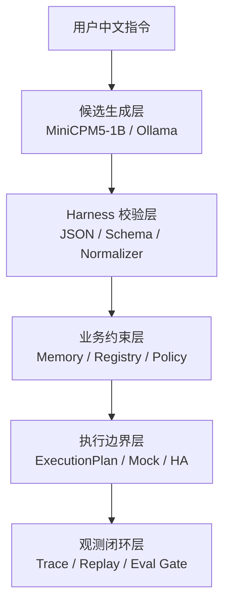
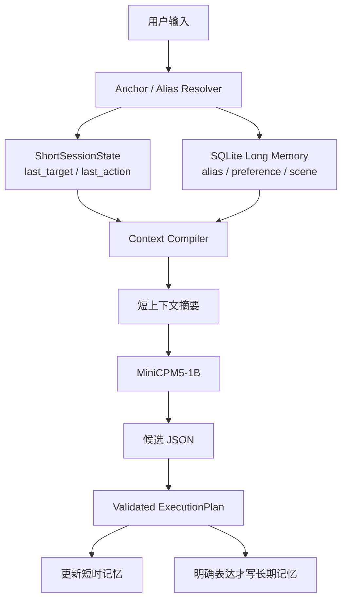
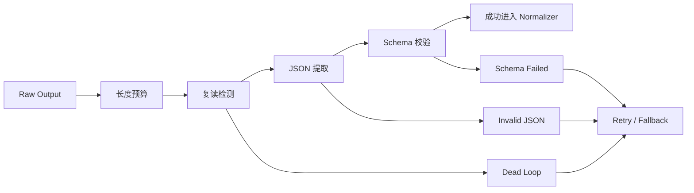
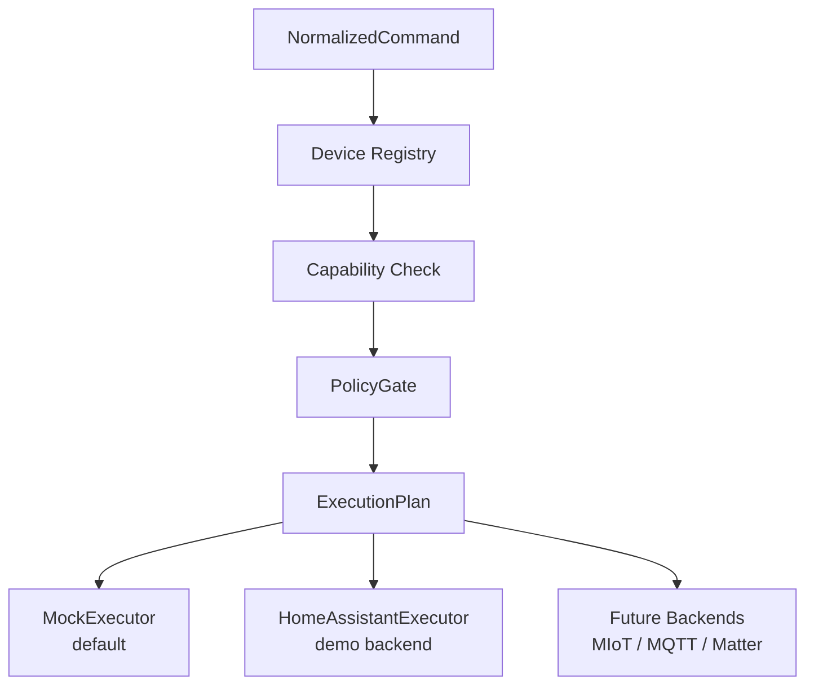
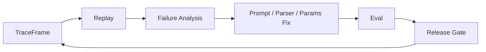

# EdgeHome Harness

EdgeHome Harness 是一个面向 **1B 端侧小模型** 的 **Rust Agent Harness** 项目。

它的产品形态是智能家居本地控制中台，但项目本体不是智能家居 App，也不是米家 App、小米音箱或 Home Assistant 的替代品。

项目真正要证明的是：

```text
如何把一个容易复读、死循环、输出不稳定的 1B 本地小模型，
约束成一个可以解析中文 IoT 指令、稳定输出结构化 JSON、
支持短时指代、具备低内存降级、可审计回放、可评测迭代的 Agent Harness。
```

一句话定位：

```text
EdgeHome Harness =
1B 端侧小模型
+ Rust Harness
+ Runtime Memory
+ Output Governor
+ Device Registry / Policy / ExecutionPlan
+ Trace / Replay / Eval / Release Gate
+ 智能家居本地控制场景
```

更工程化地说：

```text
MiniCPM5-1B 只负责生成候选 JSON。
Rust Harness 负责把候选 JSON 变成可验证的 ExecutionPlan。
Runtime Memory 负责实时上下文和指代解析。
Output Governor 负责治理 1B 小模型的复读、死循环、坏 JSON 和过长输出。
Device Registry / Policy / Executor Boundary 负责设备可控和执行边界。
Trace / Replay / Eval 负责失败复盘、参数比较和版本回归。
智能家居控制只是验证 Harness 能力的垂直场景。
```

## 为什么不是普通智能家居 Demo

如果只是做一个“用户说开灯，模型输出 JSON，然后调用设备”的 demo，Ollama structured outputs 已经能解决一部分格式问题。

但这个项目要解决的不是 JSON 语法，而是端侧小模型进入真实执行链路前的工程约束。

Ollama structured outputs 能做：

```text
让输出更像 JSON
减少畸形字段
降低解释文本混入概率
```

EdgeHome Harness 必须继续解决：

```text
模型是否死循环
JSON 是否符合业务 schema
房间和设备是否存在
设备是否支持这个 action
亮度、温度、时间等参数是否合法
短时记忆是否能解析“刚才那个”
长期别名是否由用户明确写入
2GB RAM 下是否需要禁用记忆注入
执行是否只走 dry-run 或安全 executor
失败是否可追踪、可回放、可评测
```

核心原则：

```text
ModelOutput != Command
```

模型输出永远只是候选。
真正能进入执行层的只能是 Rust Harness 生成并校验过的 `ExecutionPlan`。

## 架构修正

早期版本曾考虑把证据系统放在在线执行门控里，要求普通动作也等待完整证据链。

这个设计更适合报销、审批、工单、合同审核这类慢速强证据企业 Agent，不适合智能家居本地实时控制。

V2 已经把架构修正为：

```text
Runtime Memory 是在线主路径。
Trace / Replay / Eval 是工程观测闭环。
Evidence 不再 gate 用户动作，而是 gate Harness 迭代质量。
```

因此当前项目口径是：

```text
Memory for runtime.
Evidence for debugging.
Eval for progress.
Policy for deterministic hard constraints.
LLM for candidate JSON only.
```

## 总体分层



这张图只表达一件事：小模型在最前面，业务真相和执行许可都在 Rust Harness 后面。

## 在线主路径

```mermaid
flowchart LR
    A["Input Guard"] --> B["Rule Parser"]
    B --> C["Runtime Memory"]
    C --> D["Context Compiler"]
    D --> E["LLM Candidate JSON"]
    E --> F["Output Governor"]
    F --> G["Schema + Normalizer"]
    G --> H["Registry + Policy"]
    H --> I["ExecutionPlan"]
    I --> J["Executor + Trace"]
```



单次请求的关键阶段：

```text
1. 用户输入进入 Input Guard。
2. Rule Parser 先处理高确定性指令。
3. Runtime Memory 读取短时状态和相关长期偏好。
4. Context Compiler 生成极短上下文摘要。
5. Ollama / MiniCPM5-1B 生成候选 JSON。
6. Output Governor 检查超时、复读、过长输出和重试次数。
7. JSON Parser 与 schema validator 确认结构合法。
8. Semantic Normalizer 把中文槽位归一成内部命令。
9. Device Registry 校验设备存在和 capability。
10. PolicyGate 做确定性策略判断。
11. Execution Planner 生成 dry-run 或执行计划。
12. Executor Router 调用 MockExecutor 或 HomeAssistantExecutor。
13. Trace Recorder 记录可回放链路。
14. Memory Writer 更新短时状态或明确长期偏好。
```

模型永远不能直接接触：

```text
Home Assistant token
miIO token
设备 IP
局域网密钥
Home Assistant entity_id
真实 executor route
SQLite 原始记忆表
```

模型最多看到：

```text
受限 JSON schema
少量设备候选摘要
极短上下文摘要
必要的业务约束
```

## Runtime Memory

记忆系统是 V2 的在线主路径。

它不依赖 Ollama CLI 历史，也不让模型自己维护长对话。



短时记忆只保留最近少量轮次，核心是结构化状态，而不是完整自然语言历史。

示例：

```json
{
  "last_target": {
    "room": "living_room",
    "device_type": "light",
    "device_id": "living_room_main_light"
  },
  "last_action": "set_brightness",
  "last_value": 70
}
```

用于处理：

```text
再暗一点
再亮一点
把刚才那个关掉
切换成除湿模式
恢复刚才的设置
```

长期记忆存在 SQLite，不常驻 prompt。

适合存储：

```text
设备别名
房间别名
用户偏好
常用场景
安全偏好
设备默认参数
```

长期记忆写入规则：

```text
只有用户明确说“以后 / 默认 / 记住 / 叫做”才写入。
一次性控制不写长期记忆。
模型猜测不写长期记忆。
降低安全限制的偏好不写长期记忆。
```

默认预算：

```text
短时记忆最多 3 轮
长期偏好最多 3 条
记忆摘要 300-500 中文字符以内
低内存时禁用长期偏好注入
```

## Output Governor

1B 小模型最大的问题不是“不会聊天”，而是：

```text
输出解释文本
输出坏 JSON
输出重复片段
陷入 think / 复读 / 死循环
输出过长导致低内存设备压力上升
```

Output Governor 负责把模型输出限制在可治理范围内：



治理点：

```text
限制 num_predict
限制输出字符数和字节数
检测重复片段
限制重试次数
记录失败原因
触发 fallback
保证 CLI 不被模型卡死
```

推荐 low_memory 起点：

```yaml
temperature: 0.1
top_p: 0.8
top_k: 20
repeat_penalty: 1.25
num_ctx: 1024
num_predict: 128
retry_count: 1
```

参数文档见：

```text
docs/model-parameters.md
```

## 设备和执行边界

执行层只接受 `ExecutionPlan`。



默认执行后端：

```text
MockExecutor
```

真实设备 demo 后端：

```text
HomeAssistantExecutor
```

边界：

```text
Home Assistant 是 demo backend，不是项目本体。
项目不声称完整替代 Home Assistant。
项目不声称所有米家设备都能纯离线控制。
真实 execute 默认关闭。
eval 不依赖真实设备。
```

Executor 不能接受：

```text
用户原始输入
模型原始输出
未经 schema 校验的 JSON
未经设备注册表确认的 command
```

## Trace / Replay / Eval

Trace 不是普通动作的同步执行门禁。
它是 Harness 的工程观测系统。



TraceFrame 记录：

```text
原始用户输入
模型名称和参数
运行 profile
记忆摘要
模型原始输出
JSON 清洗结果
schema 校验结果
语义归一结果
设备解析结果
capability 校验结果
ExecutionPlan
executor 结果
失败原因
重试次数
latency
memory pressure
```

这就是 V2 的证据使用方式：

```text
Evidence 不 gate 用户动作。
Evidence gate Harness release quality。
```

## 2GB RAM Profile

EdgeHome Harness 的低内存策略不是“硬跑大上下文”，而是：

```text
短 prompt
短输出
短记忆
强 schema
强 fallback
默认 dry-run
必要时 rule-only
```

默认限制：

```text
num_ctx <= 1024
num_predict <= 128
短时记忆 <= 3 轮
记忆摘要 <= 500 字符
retry_count <= 1
低内存时禁用长期偏好注入
```

内存压力三档：

| 空闲内存 | 档位 | 行为 |
| ---: | --- | --- |
| `>512MB` | normal | 保持 low_memory profile，`memory_enabled=true` |
| `257-512MB` | elevated | `num_ctx<=768`，`num_predict<=96`，fallback 到 `compact_json` |
| `<=256MB` | critical | `num_ctx<=512`，`num_predict<=64`，`memory_enabled=false`，fallback 到 `rule_only` |

详情见：

```text
docs/2gb-profile.md
```

当前仓库没有声称已经完成真实 2GB ARM 板卡 benchmark。
当前已经验证的是 low_memory profile、ContextCompiler 预算、OutputGovernor、pressure decision CLI 和 eval gate。

## Rust Workspace

当前 workspace 模块：

```text
edgehome-core       domain contracts, schema, ExecutionPlan
edgehome-config     runtime profiles, low_memory config
edgehome-storage    SQLite persistence
edgehome-trace      trace, audit, replay data
edgehome-parser     input guard, rule parser, JSON cleaner, normalizer
edgehome-registry   device registry, capability model, state freshness
edgehome-gate       deterministic policy checks
edgehome-memory     short memory, long preference memory, context assembly
edgehome-ollama     Ollama adapter, MiniCPM5 profile, OutputGovernor
edgehome-executor   dry-run, MockExecutor, HomeAssistantExecutor
edgehome-eval       eval case loading and metrics
edgehome-cli        config, parse, dry-run, eval, replay, trace commands
```

## 当前已实现能力

当前可以写成已实现：

```text
Rust workspace 与多 crate 分层
中文 IoT 指令 parser / normalizer
Ollama structured output 适配层
OutputGovernor 的输出治理与 dead-loop fallback 测试
Runtime Memory 的短时状态、长期别名、ContextCompiler 预算
SQLite 持久化
Device Registry / capability 校验
PolicyGate 确定性拒绝 blocked action
MockExecutor 默认执行路径
HomeAssistantExecutor demo backend 边界测试
TraceFrame / replay / trace export
Eval report 与 --gate release gate
low_memory profile 与 pressure decision CLI
scripts/demo.ps1 面试演示脚本
```

当前只能写成后续可选，不能写成已实现：

```text
全量米家本地控制
MIoT / miIO / Matter / MQTT 完整 adapter
真实 2GB ARM 板长期压测数据
Web dashboard
HTTP daemon mode
多模型自动路由
向量数据库记忆
开放聊天助手
语音唤醒 / ASR / TTS
```

## 快速验证

Windows 路径包含中文时建议指定 target：

```powershell
$env:CARGO_TARGET_DIR="$env:TEMP\edgehome-target"
```

基础验证：

```powershell
cargo fmt --all --check
cargo check
cargo test
```

查看配置：

```powershell
cargo run -q -p edgehome-cli -- config show
```

查看 2GB profile 的内存压力降级决策：

```powershell
cargo run -q -p edgehome-cli -- config pressure --free-memory-mb 1024
cargo run -q -p edgehome-cli -- config pressure --free-memory-mb 400
cargo run -q -p edgehome-cli -- config pressure --free-memory-mb 128
```

运行评测：

```powershell
cargo run -q -p edgehome-cli -- --db-path edgehome-eval.sqlite eval cases/zh-home.yaml
```

运行 release gate：

```powershell
cargo run -q -p edgehome-cli -- --db-path edgehome-gate.sqlite eval cases/zh-home.yaml --gate
```

运行 demo：

```powershell
powershell -ExecutionPolicy Bypass -File scripts\demo.ps1 -DatabasePath edgehome-demo.sqlite
```

面试演示说明见：

```text
docs/demo-walkthrough.md
```

## 当前 Eval 基线

当前 `cases/zh-home.yaml` 覆盖：

```text
普通关灯
短时相对指令
时间 + 亮度槽位
明确长期别名写入
长期别名解析
空调温度
空调开关
门锁策略样例
摄像头策略样例
燃气报警器拒绝样例
```

当前 mock + low_memory gate 应满足：

```text
total = 11
passed = 11
failed = 0
pass_rate = 1.0
intent_accuracy = 1.0
slot_accuracy = 1.0
policy_accuracy = 1.0
dry_run_accuracy = 1.0
trace_coverage = 1.0
schema_valid_rate = 1.0
memory_resolution_accuracy = 1.0
fallback_rate = 0.0
dead_loop_rate = 0.0
retry_rate = 0.0
gate.passed = true
```

注意：

```text
latency_avg_ms 和 latency_p95_ms 必须来自本地 eval 输出。
不要在 README 中编造未跑过的 benchmark。
```

## Demo Walkthrough

`scripts/demo.ps1` 默认使用 mock model 和 `MockExecutor`，不依赖真实设备。

演示顺序：

```text
1. Release gate：cases/zh-home.yaml --gate
2. 普通指令：把客厅灯关掉
3. 槽位抽取：晚上十点后把走廊灯调到 30%
4. Trace replay / trace export
5. 短时记忆：把刚才那个灯再调暗一点
6. 长期别名：以后把玄关灯叫小夜灯，打开小夜灯
7. 危险动作拒绝：关闭燃气报警器
8. 2GB 降级策略：normal / elevated / critical
9. OutputGovernor dead-loop fallback 测试
```

详细讲法见：

```text
docs/demo-walkthrough.md
```

## 部署模式

推荐路线：

```text
Mode A：2GB Edge Harness + Home Assistant on LAN
Mode B：4GB/8GB All-in-One
Mode C：2GB Ultra-Local + MIoT / miIO subset，后续可选
```

当前主线：

```text
优先 MockExecutor / dry-run / eval。
HomeAssistantExecutor 作为 demo backend。
真实 execute 默认关闭。
MIoT / miIO / MQTT / Matter 只作为未来 backend 扩展描述。
```

详情见：

```text
docs/deployment-modes.md
docs/home-assistant-demo.md
```

## 面试表达

可以这样解释项目：

```text
我没有只做一个“模型输出 JSON”的 demo。
这个项目围绕 1B 端侧小模型做了完整 Harness：

第一，小模型只输出候选 JSON，不直接执行。
第二，Rust 管理结构化记忆，解决“再暗一点”“刚才那个”等多轮指代。
第三，Output Governor 处理死循环、复读、坏 JSON、超时和重试。
第四，Device Registry 和 capability model 保证设备和动作可控。
第五，Trace / Replay / Eval 让失败可以复盘，模型参数和 prompt 可以回归评测。
第六，2GB low_memory profile 约束上下文、输出、重试和记忆注入。

智能家居只是落地场景，项目核心是端侧小模型 Agent Harness 工程。
```

## 非目标

V2 不做这些承诺：

```text
不承诺替代米家 App
不承诺替代小米音箱
不承诺替代 Home Assistant
不承诺所有米家设备都纯离线可控
不承诺 1B 小模型可以开放聊天
不把证据系统作为普通动作的同步门禁
不让模型直接控制真实设备
不声明已经完成真实 2GB ARM 板长期 benchmark
```

## 后续计划

后续唯一计划见：

```text
plan.md
```

M26 完成后，V2 主线进入文档、demo、eval 已同步的收尾状态。
M27 之后的 MIoT / MQTT / Web dashboard / trace 可视化都属于可选扩展，不能阻塞当前 Harness 主线。
