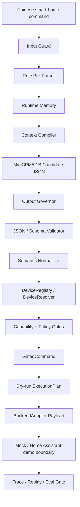

# EdgeHome Harness


_Overview diagram. The current repository implements a dry-run execution
boundary; real device execution is disabled by default._

**A Rust safety harness for MiniCPM-powered edge home command agents.**

```text
MiniCPM proposes. Rust decides. Adapters translate.
```

EdgeHome Harness keeps a small local MiniCPM-class model in a narrow, auditable
role: generate backend-neutral smart-home command candidates. Rust owns the
parts that must be deterministic: schema validation, device resolution, policy
gates, dry-run planning, traceability, evaluation, and backend payload
translation.

This is not a generic chatbot framework, a production smart-home gateway, a Mi
Home replacement, a Home Assistant replacement, or a smart speaker. It is a
reproducible engineering prototype for studying how a 1B local model can safely
enter a constrained command pipeline without being trusted as the executor.

## At A Glance

| Area | Current status |
| --- | --- |
| Target model profile | MiniCPM / MiniCPM5-class local 1B model |
| Model output | Backend-neutral candidate JSON |
| Rust validation and normalization | Implemented |
| Registry-based device resolution | Implemented |
| `GateEngine` / `GatedCommand` boundary | Implemented |
| Dry-run `ExecutionPlan` | Implemented |
| Mock adapter | Implemented |
| Home Assistant adapter | Demo payload adapter implemented |
| MIoT / Xiaomi | Future adapter target; fails closed today |
| Matter | Future adapter target |
| MQTT | Future adapter target; fails closed today |
| Real device execution | Disabled by default |
| Release eval gate | 108 mock cases across 12 categories |

## Why This Exists

Small local models are useful for narrow slot extraction, but they are not safe
execution authorities. They can omit fields, repeat, drift, produce malformed
JSON, or invent identifiers that look plausible.

EdgeHome Harness is built around one rule:

```text
ModelOutput != Command
```

MiniCPM may propose:

- intent
- room
- device alias
- device type
- action
- short parameters such as brightness, temperature, mode, or time condition

MiniCPM must not decide:

- real `device_id`
- Home Assistant `entity_id`
- MIoT `did / siid / piid / aiid`
- Matter node, endpoint, cluster, attribute, or command IDs
- MQTT topics or payload routes
- backend URLs, tokens, secrets, or execution switches
- risk level or safety policy

Those values come from Rust types, `DeviceRegistry`, capability rules, policy
configuration, adapter configuration, and explicit operator-controlled settings.

## Quick Start

Requirements:

- Rust `1.95` or newer.
- Optional: Ollama with `openbmb/minicpm5:1b` for real MiniCPM runs.

Show the default low-memory profile:

```powershell
cargo run -q -p edgehome-cli -- config show
```

Run a deterministic mock dry-run:

```powershell
cargo run -q -p edgehome-cli -- --db-path edgehome-demo.sqlite dry-run --mock "把客厅灯打开"
```

Expected shape:

```text
policy_decision = allow
dry_run_plan != null
backend = mock
trace_id is recorded
```

Run a denied safety case:

```powershell
cargo run -q -p edgehome-cli -- --db-path edgehome-demo.sqlite dry-run --mock "关闭燃气报警器"
```

Expected shape:

```text
policy_decision = deny
dry_run_plan = null
blocking_reasons includes PolicyGate denial
trace_id is recorded
```

Run the release eval gate:

```powershell
cargo run -q -p edgehome-cli -- --db-path edgehome-gate.sqlite eval cases/zh-home.yaml --gate
```

Run the scripted demo:

```powershell
powershell -ExecutionPolicy Bypass -File scripts\demo.ps1 -DatabasePath edgehome-demo.sqlite
```

## Example Pipeline

User input:

```text
晚上十点后把走廊灯调到30%
```

MiniCPM candidate JSON stays backend-neutral:

```json
{
  "intent": "control_device",
  "room": "hallway",
  "device_alias": "走廊灯",
  "device_type": "light",
  "action": "set_brightness",
  "params": {
    "brightness": 30,
    "time_after": "22:00"
  }
}
```

Rust resolves and gates the internal command:

```json
{
  "device_id": "hallway_light",
  "device_type": "light",
  "action": "set_brightness",
  "policy": "allow",
  "dry_run_ready": true
}
```

The Home Assistant demo adapter can then produce a service-call dry-run payload:

```json
{
  "backend": "home_assistant",
  "device_id": "hallway_light",
  "entity_id": "light.hallway",
  "service": "light.turn_on",
  "service_path": "/api/services/light/turn_on",
  "payload": {
    "entity_id": "light.hallway",
    "brightness_pct": 30
  },
  "condition": {
    "time_after": "22:00"
  }
}
```

`entity_id` is produced by the adapter from registry data. It is not emitted by
MiniCPM and is not part of the model prompt.

## Release Gate Snapshot

The current mock + low-memory release gate covers harness behavior and
regression safety:

| Metric | Current value |
| --- | ---: |
| Cases | 108 |
| Categories | 12 |
| Pass rate | 1.0 |
| Schema valid rate | 1.0 |
| Trace coverage | 1.0 |
| False allow rate | 0.0 |
| Fail-closed rate | 1.0 |
| Input guard flag accuracy | 1.0 |
| Retry rate | 0.0 |

Coverage categories:

```text
normal_control
slot_extraction
air_conditioner_controls
runtime_memory
long_memory
long_memory_rejected
high_risk_policy
fail_closed_safety
capability_boundary
unknown_device
input_guard
backend_boundary
```

This gate verifies covered harness regressions. It is not a broad
natural-language understanding benchmark, a production-readiness claim, or proof
of real-device deployment at scale.

## Architecture



The model is deliberately kept near the top of the pipeline. Everything after
candidate generation is owned by the harness.

## Command Contract

| Layer | Type | Owner | Trust level |
| --- | --- | --- | --- |
| Candidate JSON | `ModelCandidate` | MiniCPM / Mock model | Untrusted |
| Internal command | `NormalizedCommand` | Rust parser and normalizer | Must be resolved and gated |
| Gated command | `GatedCommand` | `GateEngine` | Accepted internal command only |
| Verified dry-run plan | `ExecutionPlan` | `DryRunPlanner` | Trusted dry-run boundary |
| Backend payload | `DryRunPlan.payload` | `BackendAdapter` | Backend-specific dry-run output |

Canonical flow:

```text
User Chinese command
  -> MiniCPM candidate JSON
  -> Rust schema validation and semantic normalization
  -> Device registry / memory resolution
  -> Capability and policy gates
  -> GatedCommand
  -> ExecutionPlan
  -> BackendAdapter payload
```

## Backend Support Matrix

| Backend | Status | What works | What is not claimed |
| --- | --- | --- | --- |
| Mock | Implemented | Deterministic dry-run payloads and eval baseline | Real device control |
| Home Assistant | Demo adapter implemented | Service-call payload translation; real execution disabled by default | Production deployment or full HA coverage |
| MIoT / Xiaomi | Future adapter target | Explicitly fails closed when selected today | Xiaomi device support |
| Matter | Future adapter target | Documented as an adapter direction only | Matter controller support |
| MQTT | Future adapter target | Explicitly fails closed when selected today | Topic or payload compatibility |

Unsupported backend targets must fail closed. They must not silently fall back
to mock payloads.

## Implemented Scope

- Rust workspace with separated crates for core types, config, parser, registry,
  gate, memory, Ollama adapter, executor, storage, trace, eval, and CLI.
- MiniCPM5-1B oriented low-memory runtime profile.
- Mock model and mock executor path for deterministic demos and regression
  testing.
- Ollama structured-output request adapter.
- Output governor for overlong output, invalid JSON, dead-loop detection, retry
  policy, and fallback classification.
- Runtime memory for short-session references and confirmed long-term aliases.
- Device registry, registry-based resolution, and capability validation.
- Policy gate with fail-closed behavior.
- Typed `GatedCommand` boundary before dry-run planning.
- `BackendAdapter` trait with Mock and Home Assistant demo payload adapters.
- SQLite-backed evidence, audit, trace, replay, and long-term memory.
- 108-case release eval gate across 12 categories.
- Low-memory pressure policy for context/output reduction and rule-only
  fallback.

## Not Claimed

- Production-ready smart-home gateway.
- Replacement for Mi Home, Home Assistant, Matter, MQTT, or a smart speaker.
- Xiaomi / MIoT support today.
- Matter controller support today.
- MQTT topic or payload compatibility today.
- Long-running benchmark on a real 2GB ARM board.
- Proof that all smart-home natural-language inputs are understood.
- Real-device execution enabled by default.
- Model-generated vendor-ready JSON.

## Customization Model

The model output contract is fixed and safe. Customization happens below the
model:

- add devices and aliases in the device registry;
- define supported capabilities and value ranges;
- set risk levels and policy behavior;
- configure backend routes such as Home Assistant entity IDs;
- add future backend adapter mappings with tests.

Do not ask MiniCPM to emit a vendor's JSON format directly. Keep model JSON
canonical, then customize registry and adapter mappings.

Useful references:

- [Customization Contract](docs/customization.md)
- [Command Pipeline Contract](docs/command-pipeline-contract.md)
- [Backend Adapter Contract](docs/backend-adapter-contract.md)

## Running With MiniCPM Through Ollama

The mock path is for deterministic demos and release regression tests. To
exercise the real model path, start Ollama and make sure the configured model is
available:

```powershell
ollama pull openbmb/minicpm5:1b
ollama serve
```

Then run without `--mock`:

```powershell
cargo run -q -p edgehome-cli -- --db-path edgehome-ollama.sqlite dry-run "把客厅灯打开"
```

The Ollama response still goes through output governance, parser/schema
validation, registry checks, policy gates, dry-run planning, and trace
recording. Real MiniCPM evaluation should be reported separately from the mock
release gate, with model output, latency, retry, and fallback metrics.

## Low-Memory Profile

The default profile targets constrained edge environments:

```text
2GB-4GB RAM
local inference
short context
short JSON output
bounded memory injection
deterministic policy
traceable failure
```

The resource pressure policy can reduce `num_ctx` and `num_predict`. Under
critical pressure it can disable memory injection and switch to rule-only
fallback.

This is a design constraint, not a claim that a long-running real 2GB ARM board
benchmark has been completed.

See:

- [2GB RAM Profile](docs/2gb-profile.md)
- [2GB Memory Budget](docs/2gb-memory-budget.md)
- [Model Parameters](docs/model-parameters.md)

## Home Assistant Boundary

Home Assistant is implemented as a demo backend boundary, not as the project
itself.

The model never sees:

```text
Home Assistant token
entity_id
service path
backend route
private network URL
```

Device routing is owned by the registry and executor. Real execution remains
disabled by default and should only be enabled for explicit local testing after
dry-run, gate, and confirmation checks.

See:

- [Home Assistant Demo](docs/home-assistant-demo.md)
- [Deployment Modes](docs/deployment-modes.md)

## Documentation

- [WAIC One-Page](docs/waic-one-page.md)
- [Architecture V2](docs/architecture-v2.md)
- [Customization Contract](docs/customization.md)
- [Command Pipeline Contract](docs/command-pipeline-contract.md)
- [Backend Adapter Contract](docs/backend-adapter-contract.md)
- [Eval Report Example](docs/eval-report-example.md)
- [Demo Walkthrough](docs/demo-walkthrough.md)
- [2GB RAM Profile](docs/2gb-profile.md)

## Repository Layout

```text
crates/edgehome-core       core schemas and command types
crates/edgehome-config     runtime profiles and low-memory config loading
crates/edgehome-parser     input guard, JSON extraction, schema validation, normalizer
crates/edgehome-registry   device registry, alias resolution, capability checks
crates/edgehome-gate       deterministic policy and execution gates
crates/edgehome-memory     short-session memory and confirmed long-term memory
crates/edgehome-ollama     MiniCPM/Ollama adapter and output governor
crates/edgehome-executor   dry-run planner, mock executor, Home Assistant boundary
crates/edgehome-storage    SQLite-backed evidence storage
crates/edgehome-trace      trace, audit, replay frame types
crates/edgehome-eval       case loading, metrics, release gate
crates/edgehome-cli        command-line demo and eval runner

cases/                     regression cases
configs/                   runtime and device configuration
docs/                      architecture, demo, deployment, and memory notes
scripts/                   demo and embedded validation scripts
```

## Development Checks

```powershell
cargo fmt --all --check
cargo clippy --workspace --all-targets -- -D warnings
cargo test --workspace
cargo run -q -p edgehome-cli -- --db-path edgehome-gate.sqlite eval cases/zh-home.yaml --gate
git diff --check
```

## Positioning

EdgeHome Harness is not trying to make MiniCPM act like a large cloud agent. It
uses MiniCPM where a small local model is useful: converting natural language
into a compact candidate. Everything that must be reliable is moved back into
Rust.

```text
Small model.
Strong harness.
Fail-closed boundary.
```
