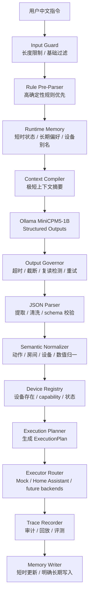

# EdgeHome Harness

EdgeHome Harness 是一个面向 1B 端侧小模型的 Rust Agent Harness 项目。
它的产品形态是智能家居本地控制中台，但项目本体不是智能家居 App，也不是米家 App、小米音箱或 Home Assistant 的替代品。

项目真正要证明的是：

```text
如何把一个容易复读、死循环、输出不稳定的 1B 本地小模型，
约束成一个可以解析中文 IoT 指令、输出稳定 JSON、
支持短时指代、具备低内存降级、可审计回放、可评测迭代的 Agent Harness。
```

一句话定位：

```text
EdgeHome Harness = 1B 端侧小模型 + Rust Harness + Runtime Memory + Output Governor + Trace Replay Eval + 本地智能家居控制中台
```

更工程化地说：

```text
MiniCPM5-1B 只负责生成候选 JSON。
Rust Harness 负责把候选 JSON 变成可验证的 ExecutionPlan。
Runtime Memory 负责实时上下文和指代解析。
Trace / Replay / Eval 负责失败复盘、模型参数比较和版本回归。
智能家居控制只是验证 Harness 能力的垂直场景。
```

## 当前架构修正

早期版本曾把证据系统放在在线执行门控里。
这个设计更适合报销、审批、工单、合同审核这类慢速强证据企业 Agent，不适合智能家居本地实时控制。

V2 已经把架构修正为：

```text
Runtime Memory 是在线主路径。
Trace / Replay / Eval 是工程观测闭环。
Evidence 不再 gate 用户动作，而是 gate Harness 迭代质量。
```

这意味着：

```text
普通实时指令不需要等待完整证据链。
所有模型输出仍然必须经过确定性校验。
所有关键决策都必须可 trace。
所有失败都必须可 replay。
所有模型参数、prompt、parser 改动都必须能通过 eval 回归。
```

## 为什么需要 Harness

Ollama structured outputs 能让模型更容易输出合法 JSON。
但它只能解决语法形状问题，不能解决业务执行问题。

Ollama JSON 约束能做：

```text
让输出更像 JSON
减少畸形字段
降低解释文本混入概率
```

EdgeHome Harness 必须继续解决：

```text
模型是否死循环
JSON 是否符合业务 schema
房间和设备是否存在
设备是否支持这个 action
亮度、温度、时间等参数是否合法
短时记忆是否能解析“刚才那个”
长期别名是否由用户明确写入
2GB RAM 下是否需要禁用记忆注入
执行是否只走 dry-run 或安全 executor
失败是否可追踪、可回放、可评测
```

所以本项目的核心不是“调用模型输出 JSON”，而是：

```text
把不可信的小模型候选输出，压进一条稳定、可验证、可降级、可回放的 Rust 执行链路。
```

## 总体架构



核心原则：

```text
模型只产生候选。
Rust 管业务真相。
记忆由 Rust + SQLite 管。
执行只接受 ExecutionPlan。
Trace 用于复盘和评测，不阻塞普通实时路径。
```

## 在线主路径

单次请求的关键阶段：

```text
1. 用户输入进入 Input Guard。
2. Rule Pre-Parser 先尝试解析明确指令。
3. Runtime Memory 读取短时状态和相关长期偏好。
4. Context Compiler 生成极短上下文摘要。
5. Ollama / MiniCPM5-1B 生成候选 JSON。
6. Output Governor 检查超时、复读、过长输出、重试次数。
7. JSON Parser 和 schema validator 确认结构合法。
8. Semantic Normalizer 把中文槽位归一成内部命令。
9. Device Registry 校验设备存在和 capability。
10. Execution Planner 生成 dry-run 或执行计划。
11. Executor Router 调用 MockExecutor 或 HomeAssistantExecutor。
12. Trace Recorder 记录可回放链路。
13. Memory Writer 更新短时状态或明确长期偏好。
```

模型永远不能直接接触：

```text
Home Assistant token
miIO token
设备 IP
局域网密钥
Home Assistant entity_id
真实 executor route
SQLite 原始记忆表
```

模型最多看到：

```text
受限 JSON schema
少量设备候选摘要
极短上下文摘要
必要的业务约束
```

## Runtime Memory

记忆系统是 V2 的在线主路径。
它不依赖 Ollama CLI 历史，也不让模型自己维护长对话。

业务记忆由：

```text
Rust + SQLite + 结构化状态
```

管理。

模型上下文由 Rust 每次临时编译：

```text
短时状态 + 少量相关长期偏好 + 字符预算裁剪
```

### 短时会话记忆

短时记忆只保留最近少量轮次，核心是结构化状态，而不是完整自然语言历史。

示例：

```json
{
  "last_target": {
    "room": "living_room",
    "device_type": "light",
    "device_id": "living_room_main_light"
  },
  "last_action": "set_brightness",
  "last_value": 70
}
```

用于处理：

```text
再暗一点
再亮一点
把刚才那个关掉
切换成除湿模式
恢复刚才的设置
```

### 长期极简记忆

长期记忆存在 SQLite，不常驻 prompt。

适合存储：

```text
设备别名
房间别名
用户偏好
常用场景
安全偏好
设备默认参数
```

示例：

```text
小夜灯 = hallway_light
卧室空调默认温度 = 26
睡觉模式灯光亮度 = 30
门锁夜间必须二次确认
```

长期记忆写入规则：

```text
只有用户明确说“以后 / 默认 / 记住 / 叫做”才写入。
一次性控制不写长期记忆。
模型猜测不写长期记忆。
降低安全限制的偏好不写长期记忆。
```

### Context Compiler

每次请求前，Harness 只给模型注入短摘要。

示例：

```text
当前会话摘要：
- 上一次目标设备：living_room_main_light
- 上一次动作：set_brightness
- 上一次亮度：70

相关偏好：
- 小夜灯 = hallway_light
- 卧室空调默认温度：26
```

默认预算：

```text
短时记忆最多 3 轮
长期偏好最多 3 条
记忆摘要 300-500 中文字符以内
低内存时禁用长期偏好注入
```

## Output Governor

1B 小模型最大的问题不是“不会聊天”，而是：

```text
输出解释文本
输出坏 JSON
输出重复片段
陷入 think / 复读 / 死循环
输出过长导致低内存设备压力上升
```

Output Governor 的职责：

```text
限制 num_predict
限制输出字符数和字节数
检测重复片段
限制重试次数
记录失败原因
触发 fallback
保证 CLI 不被模型卡死
```

当前模型参数文档见：

```text
docs/model-parameters.md
```

推荐 low_memory 起点：

```yaml
temperature: 0.1
top_p: 0.8
top_k: 20
repeat_penalty: 1.25
num_ctx: 1024
num_predict: 128
retry_count: 1
```

## Trace / Replay / Eval

Trace 不是普通动作的同步执行门禁。
它是 Harness 的工程观测系统。

Trace 负责记录：

```text
原始用户输入
模型名称和参数
运行 profile
记忆摘要
模型原始输出
JSON 清洗结果
schema 校验结果
语义归一结果
设备解析结果
capability 校验结果
ExecutionPlan
executor 结果
失败原因
重试次数
latency
memory pressure
```

Replay 用于回答：

```text
这次为什么解析成这个设备？
模型原始输出是什么？
Harness 清洗了什么？
哪一步失败了？
为什么进入 fallback？
这个版本是否比上个版本退化？
```

Eval 用于比较：

```text
不同模型
不同温度
不同 num_predict
不同 prompt
不同 parser 策略
不同 memory 注入策略
```

这就是 V2 的证据使用方式：

```text
Evidence 不 gate 用户动作。
Evidence gate Harness release quality。
```

## 设备和执行边界

默认执行后端：

```text
MockExecutor
```

真实设备 demo 后端：

```text
HomeAssistantExecutor
```

未来可扩展：

```text
MIoT / miIO local subset
MQTT
Matter
ESPHome
```

边界：

```text
Home Assistant 是 demo backend，不是项目本体。
项目不声称完整替代 Home Assistant。
项目不声称所有米家设备都能纯离线控制。
真实 execute 默认关闭。
eval 不依赖真实设备。
```

Executor 只能接受：

```text
ExecutionPlan
```

不能接受：

```text
用户原始输入
模型原始输出
未经 schema 校验的 JSON
未经设备注册表确认的 command
```

## 2GB RAM 约束

EdgeHome Harness 的低内存策略不是“硬跑大模型”，而是：

```text
短 prompt
短输出
短记忆
强 schema
强 fallback
默认 dry-run
必要时 rule-only
```

默认限制：

```text
num_ctx <= 1024
num_predict <= 128
短时记忆 <= 3 轮
记忆摘要 <= 500 字符
retry_count <= 1
低内存时禁用长期偏好注入
```

详情见：

```text
docs/2gb-profile.md
```

## Rust Workspace

当前 workspace 模块：

```text
edgehome-core       domain contracts, schema, ExecutionPlan
edgehome-config     runtime profiles, low_memory config
edgehome-storage    SQLite persistence
edgehome-trace      trace, audit, replay data
edgehome-parser     input guard, rule parser, JSON cleaner, normalizer
edgehome-registry   device registry, capability model, state freshness
edgehome-gate       deterministic policy checks
edgehome-memory     short memory, long preference memory, context assembly
edgehome-ollama     Ollama adapter, MiniCPM5 profile, OutputGovernor
edgehome-executor   dry-run, MockExecutor, HomeAssistantExecutor
edgehome-eval       eval case loading and metrics
edgehome-cli        config, parse, dry-run, eval, replay, trace commands
```

## 快速验证

Windows 路径包含中文时建议指定 target：

```powershell
$env:CARGO_TARGET_DIR="$env:TEMP\edgehome-target"
```

基础验证：

```powershell
cargo fmt --all --check
cargo check
cargo test
```

查看配置：

```powershell
cargo run -q -p edgehome-cli -- config show
```

运行评测：

```powershell
cargo run -q -p edgehome-cli -- --db-path edgehome-eval.sqlite eval cases/zh-home.yaml
```

运行 demo：

```powershell
powershell -ExecutionPolicy Bypass -File scripts\demo.ps1 -DatabasePath edgehome-demo.sqlite
```

## 当前 Eval 基线

当前 `cases/zh-home.yaml` 覆盖：

```text
普通关灯
短时相对指令
时间 + 亮度槽位
明确长期别名写入
长期别名解析
空调温度
空调开关
门锁策略样例
摄像头策略样例
燃气报警器拒绝样例
```

最新本地基线应接近：

```text
passed = 11
failed = 0
intent_accuracy = 1.0
slot_accuracy = 1.0
policy_accuracy = 1.0
dry_run_accuracy = 1.0
trace_coverage = 1.0
```

注意：

```text
指标必须来自本地 eval 输出。
不要在 README 中编造未跑过的 benchmark。
```

## 项目 Roadmap

后续唯一计划见：

```text
plan.md
```

当前 V2 顺序：

```text
M16 架构叙事修正
M17 轻量 Runtime Memory v2
M18 Context Compiler 与低内存注入策略
M19 Output Governor v2
M20 TraceFrame 与 Evidence-Backed Replay
M21 Eval Case Matrix 与模型参数评测
M22 Release Gate
M23 Executor Boundary 与设备后端边界
M24 2GB Profile 验证与降级策略
M25 面试 Demo Walkthrough
M26 README / docs 最终同步
```

## 面试表达

可以这样解释项目：

```text
我没有只做一个“模型输出 JSON”的 demo。
这个项目围绕 1B 端侧小模型做了完整 Harness：

第一，小模型只输出候选 JSON，不直接执行。
第二，Rust 管理结构化记忆，解决“再暗一点”“刚才那个”等多轮指代。
第三，Output Governor 处理死循环、复读、坏 JSON、超时和重试。
第四，Device Registry 和 capability model 保证设备和动作可控。
第五，Trace / Replay / Eval 让失败可以复盘，模型参数和 prompt 可以回归评测。
第六，2GB low_memory profile 约束上下文、输出、重试和记忆注入。

智能家居只是落地场景，项目核心是端侧小模型 Agent Harness 工程。
```

## 非目标

V2 不做这些承诺：

```text
不承诺替代米家 App
不承诺替代小米音箱
不承诺替代 Home Assistant
不承诺所有米家设备都纯离线可控
不承诺 1B 小模型可以开放聊天
不把证据系统作为普通动作的同步门禁
不让模型直接控制真实设备
```
