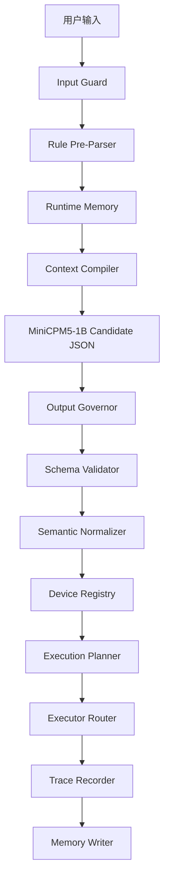

# Architecture V2

本文说明 EdgeHome Harness V2 的架构定调。

核心修正：

```text
Runtime Memory 是在线主路径。
Trace / Replay / Eval 是工程观测闭环。
Evidence 不再 gate 用户动作，而是 gate Harness 迭代质量。
```

## 为什么修正

旧版设计把证据系统放在普通执行动作之前，要求 allow / dry-run / execute 都具备完整证据链。
这个设计适合企业审批、报销、工单、合同审核等强证据、低频、慢响应场景。

智能家居本地控制不同：

```text
响应要快
动作频率高
设备状态变化快
1B 小模型能力有限
2GB RAM 约束明显
普通开关灯不应该像审批流
```

因此 V2 不再把 Evidence 作为普通动作同步门禁。

## V2 主路径



这条路径里的强制校验来自确定性代码：

```text
schema
semantic normalization
device registry
capability model
static policy config
execution plan boundary
```

不是来自小模型判断。

## Runtime Memory

Runtime Memory 负责实时交互体验。

它解决：

```text
再暗一点
把刚才那个关掉
切换成除湿模式
打开小夜灯
睡觉模式
```

它不做：

```text
不保存完整聊天历史进 prompt
不让模型自己维护长期记忆
不把失败审计记录默认注入 prompt
不让记忆降低安全限制
```

结构：

```text
ShortSessionState -> 当前会话 last_target / last_action / last_value
LongPreferenceMemory -> 用户明确设置的别名、偏好、场景
FailureAuditMemory -> 失败分析数据，不默认注入 prompt
ContextCompiler -> 每轮生成极短上下文摘要
```

## Trace / Replay / Eval

Trace 负责工程可观测性。

它记录：

```text
input_text
model_name
model_params
runtime_profile
memory_snapshot_summary
raw_model_output
cleaned_json
schema_result
normalized_command
device_resolution
capability_result
execution_plan
executor_result
failure_reason
retry_count
latency_ms
memory_pressure
```

Replay 负责复盘：

```text
这次为什么失败
模型原始输出是什么
Harness 哪一步拒绝了
fallback 为什么触发
memory 是否参与了解析
```

Eval 负责回归：

```text
同一批 case 比较不同模型
同一批 case 比较不同参数
同一批 case 比较不同 prompt/parser/memory 策略
```

## Evidence 的新位置

V2 中 Evidence 的价值不在普通动作执行门禁，而在：

```text
失败分析
评测解释
trace replay
模型参数比较
长期记忆来源追踪
release gate
```

正确表述：

```text
Evidence-backed replay
Evidence-backed eval
Evidence-gated release
```

不再使用：

```text
Evidence-gated execution
Evidence-gated command memory as online path
```

## Release Gate

Evidence 真正 gate 的对象是版本质量。

示例标准：

```text
schema_valid_rate = 1.0
dead_loop_rate = 0.0
trace_coverage = 1.0
intent_accuracy >= 0.95
slot_accuracy >= 0.90
retry_rate <= 0.30
```

这意味着：

```text
新的 prompt、参数、parser、memory 策略只有通过 eval gate，才算没有破坏 Harness 稳定性。
```

## 面试表达

可以这样讲：

```text
我没有把证据系统机械地放在每个智能家居动作前面。
普通实时动作走低延迟确定性校验。
证据系统用于 trace、replay、eval 和 release gate。
这样既保留了可追溯工程能力，又不会把智能家居控制做成慢速审批流。
```

