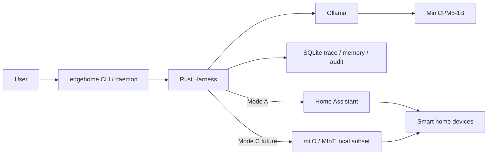

# Deployment Modes

本文说明 EdgeHome Harness 的部署模式。

项目定位要先说清楚：

```text
EdgeHome Harness 是 1B 端侧小模型 Harness。
智能家居本地控制中台是产品形态。
Home Assistant 是第一阶段 demo backend boundary，不是项目本体。
```

## 总体组件



模型只生成候选 JSON。

执行后端只接受 Harness 生成的 `ExecutionPlan`。

## Mode A：2GB Edge Harness + HA on LAN

推荐的后续真实设备 demo 模式。当前默认展示仍以 dry-run 和 payload translation 为主。

```text
2GB 边缘设备：
  Rust Harness
  SQLite
  Ollama / MiniCPM5-1B

局域网另一台机器：
  Home Assistant
  Xiaomi / ESPHome / Matter / MQTT integrations managed by Home Assistant
```

优点：

```text
2GB 设备压力较小
Harness 和模型仍在本地边缘设备
Home Assistant 已经有成熟设备生态
适合面试 demo 展示 dry-run / service-call payload / execute-disabled 边界
```

限制：

```text
Home Assistant 是否能离线控制取决于具体集成和设备
不能宣传所有米家设备都纯离线
HA token 只能由 executor 读取，不能进 prompt / audit / trace 普通字段
真实 execute 必须默认关闭
```

适合目标：

```text
先展示 Harness 架构
再在受控条件下验证 Home Assistant 后端边界
不把时间消耗在破解每一种厂商协议上
```

## Mode B：4GB/8GB All-in-One

适合开发机、小主机、树莓派 4GB/8GB 或 N100 类设备。

```text
同一台机器：
  Rust Harness
  SQLite
  Ollama / MiniCPM5-1B
  Home Assistant
```

优点：

```text
部署简单
网络链路短
适合演示完整闭环
```

限制：

```text
不是 2GB 极限证明
HA 和 Ollama 同机可能占用较多内存
需要更严格的进程监控和服务重启策略
```

适合目标：

```text
面试现场 demo
开发调试
全链路演示
```

## Mode C：2GB Ultra-Local + MiioLocalExecutor Subset

后续模式，不是 V2 主链路。

```text
2GB 边缘设备：
  Rust Harness
  SQLite
  Ollama / MiniCPM5-1B
  MiioLocalExecutor subset
```

优点：

```text
更接近真正本地控制
不依赖 HA 进程
适合少量 Wi-Fi 局域网设备
```

限制：

```text
设备覆盖面有限
不同米家设备协议差异大
token / local key 管理复杂
容易让项目焦点从 Harness 跑偏到厂商协议适配
```

因此 V2 主线不主走 Mode C。

## Home Assistant 接入边界

当前代码包含：

```text
HomeAssistantConfig
SecretsLoader
HomeAssistantClient
HomeAssistantExecutor
HA state fetch
HA dry-run service translation
HA service call translation
```

当前验收边界：

```text
MockExecutor 是默认执行路径。
HomeAssistantExecutor 是 demo backend。
真实 execute 默认关闭，需要显式 execute_enabled = true。
HomeAssistantExecutor 会拒绝非 home_assistant backend 的 dry-run plan。
eval / release gate 不依赖真实设备。
MIoT / miIO / MQTT / Matter 只作为未来 backend 扩展描述，不是当前支持能力。
```

配置样例：

```text
configs/home_assistant.yaml.example
```

真实 token 读取方式：

```powershell
$env:EDGEHOME_HA_TOKEN = "your-long-lived-access-token"
```

不要提交：

```text
真实 token
真实用户账号
真实设备 IP
局域网密钥
```

## Device Registry 到 HA Entity

模型看不到 `entity_id`。

链路是：

```text
用户说：走廊灯
  -> parser / normalizer
  -> device_id = hallway_light
  -> Device Registry
  -> backend = home_assistant
  -> backend_entity_id = light.hallway
  -> HomeAssistantExecutor
  -> light.turn_on / light.turn_off
```

这保证：

```text
模型不能选择后端
模型不能猜 entity_id
模型不能直接调用 Home Assistant
```

## Dry-run 输出

HA dry-run 应该能展示：

```json
{
  "backend": "home_assistant",
  "device_id": "hallway_light",
  "entity_id": "light.hallway",
  "service": "light.turn_on",
  "service_path": "/api/services/light/turn_on",
  "payload": {
    "entity_id": "light.hallway",
    "brightness_pct": 30
  }
}
```

注意：dry-run 可以展示 entity_id，因为这是 Harness 内部执行计划的结果。

但 entity_id 不能进入模型 prompt，也不能由模型输出。

## Execute 默认关闭

真实执行的默认状态：

```text
execute_enabled = false
```

即使实现了 `HomeAssistantExecutor::execute`，也必须满足：

```text
ExecutionPlan 已生成
GateEngine 已通过
PolicyDecision 不是 deny
配置为 require_confirmation 的动作已经 user_confirmed
ExecutionTransaction 检查 idempotency / rate limit / post-state
```

直接把模型 JSON 传给 executor 是架构违规。

## 建议命令

开发验证：

```powershell
$env:CARGO_TARGET_DIR="$env:TEMP\edgehome-target"
cargo test -p edgehome-executor
cargo run -p edgehome-cli -- --db-path edgehome-deploy-eval.sqlite eval cases/zh-home.yaml
```

HA 配置检查当前通过单测覆盖：

```text
example_config_loads_with_execution_disabled
missing_token_does_not_panic
secret_debug_is_redacted
dry_run_planner_translates_home_assistant_payload
```

## 推荐路线

V2 推荐顺序：

```text
1. low_memory + MockExecutor 跑通 eval
2. HomeAssistantExecutor dry-run 翻译
3. HA token 私有化读取
4. 局域网 HA state fetch
5. 仅在本地实验环境中，手动确认后小范围真实 execute
6. 记录真实 2GB 板卡 benchmark
```

不推荐顺序：

```text
1. 一开始就接所有米家设备
2. 一开始就做 Web UI
3. 一开始就打开真实 execute
4. 让模型输出 Home Assistant entity_id
5. 把项目讲成 Home Assistant 替代品
```

## 面试表达

可以这样讲：

```text
我没有把智能家居后端作为项目本体。
项目本体是 Rust Harness：它约束 1B 小模型，把不可信 JSON 变成经过 schema、capability、policy config、dry-run 和 trace 的 ExecutionPlan。
Home Assistant 只是第一阶段真实设备 demo 后端，因为它能让我专注展示 Harness，而不是陷入每个厂商协议的碎片化适配。
```
