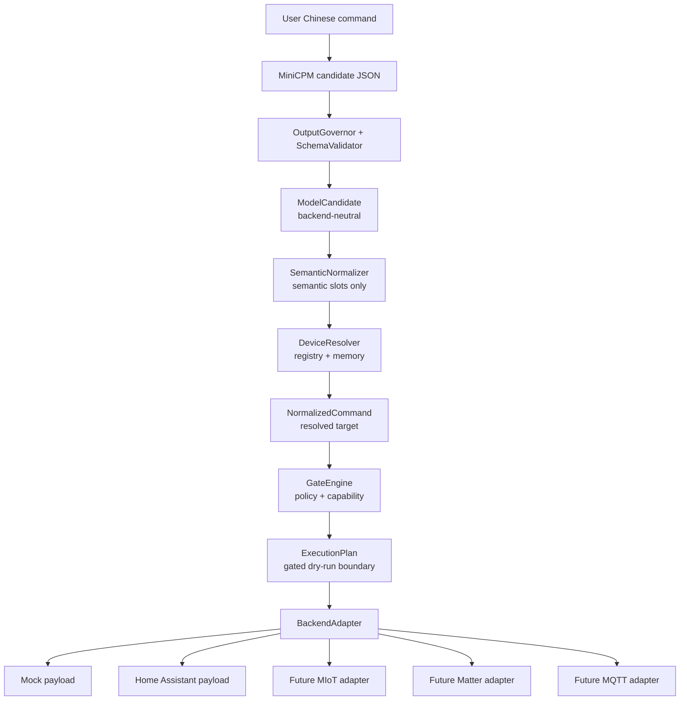

# EdgeHome Harness 对外发布加固计划

最后更新：2026-07-04

本文档是 EdgeHome Harness 后续实现、重构、README 更新、评测扩展、提交和对外宣传的执行计划。它的目标不是记录聊天讨论，而是在上下文压缩、换线程或长时间中断后，任何继续执行的人只要读取本文件，就能知道：

- 当前项目真实做到哪里。
- 哪些能力可以宣传，哪些只能写成 future target。
- 下一步从哪里开始改。
- 每个阶段前后逻辑是什么。
- 每个阶段如何验证、何时 commit。
- 最终完成后项目应该达到什么状态。

如果本文档与代码、README 或真实验证结果冲突，必须先修正本文档，再继续实现。不要一边偏离计划，一边继续写代码。

---

## 0. 当前仓库快照

工作区：

```text
C:\Users\xiaoy\Desktop\edge-home\EdgeHome-Harness
```

远程仓库：

```text
https://github.com/yushui2022/EdgeHome-Harness.git
```

当前分支：

```text
main
```

当前最新提交：

```text
c321d37 docs: internationalize README for MiniCPM harness
```

当前 README 已经英文国际化，并加入项目图片：

```text
docs/assets/edgehome-harness-overview.jpg
```

当前工作区有未提交的质量门修复，后续第一步应先单独提交，不要和架构改动混在一起。

未提交文件快照：

```text
M .gitattributes
M crates/edgehome-cli/src/main.rs
M crates/edgehome-core/src/types.rs
M crates/edgehome-eval/src/lib.rs
M crates/edgehome-executor/src/home_assistant.rs
M crates/edgehome-executor/src/lib.rs
M crates/edgehome-parser/src/lib.rs
M crates/edgehome-registry/src/lib.rs
M crates/edgehome-trace/src/lib.rs
```

这些修改已经通过过以下验证：

```powershell
cargo fmt --all --check
cargo clippy --workspace --all-targets -- -D warnings
cargo test --workspace
cargo run -q -p edgehome-cli -- --db-path "$env:TEMP\edgehome-quality-gate.sqlite" eval cases\zh-home.yaml --gate
git diff --check
```

下一步开始前，建议重新跑一遍轻量检查，然后提交：

```powershell
git status --short
cargo fmt --all --check
cargo clippy --workspace --all-targets -- -D warnings
cargo test --workspace
cargo run -q -p edgehome-cli -- --db-path "$env:TEMP\edgehome-quality-gate.sqlite" eval cases\zh-home.yaml --gate
git diff --check

git add .gitattributes crates/
git commit -m "chore: make Rust quality gates pass"
git push origin main
```

这个 commit 的意义：在对外宣传和架构升级前，基础工程质量门是干净的。

---

## 1. 项目最终定位

EdgeHome Harness 不是一个完整智能家居产品，也不是“已经支持小米 / Matter / MQTT 的万能控制平台”。

它的准确定位是：

```text
EdgeHome Harness is a Rust safety harness for MiniCPM-powered edge home command agents.
```

中文解释：

```text
EdgeHome Harness 是一个面向 MiniCPM 端侧小模型的 Rust 安全 Harness。
它用智能家居控制作为窄场景，证明小模型输出可以被约束、验证、归一化、审计、评测，并转换成后端 payload。
```

对外一句话：

```text
MiniCPM proposes. Rust decides. Adapters translate.
```

更完整的三层技术路线：

```text
User Chinese command
  -> MiniCPM backend-neutral candidate JSON
  -> Rust schema validation / normalization / registry resolution / policy gate
  -> ExecutionPlan
  -> BackendAdapter
  -> Mock / Home Assistant payload
```

MIoT / Matter / MQTT 当前只能写成：

```text
future adapter targets
```

不能写成：

```text
implemented
supported
production-ready
works with Xiaomi / Matter / MQTT
```

---

## 2. 核心不变量

后续所有代码、README、docs、demo、one page 宣传都必须遵守以下不变量。

### 2.1 ModelOutput != Command

MiniCPM 输出永远只是候选 JSON。

```text
Model output is untrusted.
It is never executed directly.
```

模型不能决定：

```text
真实 device_id
Home Assistant entity_id
MIoT did / siid / piid / aiid
Matter node / endpoint / cluster / command id
MQTT topic
token
backend URL
真实执行开关
风险等级
```

这些必须来自：

```text
Rust types
DeviceRegistry
Capability rules
Policy config
Backend adapter config
Explicit user/admin configuration
```

### 2.2 模型输出 schema 固定，后端映射可定制

不要把项目宣传成：

```text
让小模型输出任意厂家需要的 JSON。
```

正确设计是：

```text
The model output contract is fixed and safe.
The device registry and backend adapter mappings are customizable.
```

中文口径：

```text
模型输出不定制，后端映射可定制。
```

模型只输出 canonical candidate JSON，例如：

```json
{
  "schema_version": "model_output.v1",
  "intent": "control_device",
  "room": "living_room",
  "device_alias": "客厅灯",
  "device_type": "light",
  "action": "turn_on",
  "params": {}
}
```

厂家或协议 payload 由 adapter 根据 `ExecutionPlan + DeviceRegistry + AdapterProfile` 生成。

### 2.3 Rust 管设备真相

目标口径：

```text
The model never decides device IDs.
Device truth lives in the registry.
```

当前代码还没有完全做到。`SemanticNormalizer` 仍然有硬编码的 `room + device_type + action -> device_id` 映射。后续必须通过 `DeviceResolver` 改掉。

### 2.4 未实现后端必须 fail closed

未实现 backend 不能落到 mock payload。

当前代码问题：

```rust
BackendKind::Mock | BackendKind::MiioLocal | BackendKind::Mqtt => {
    Ok(mock_payload(device, command))
}
```

这会让外部读代码的人误解为 `MiioLocal` / `Mqtt` 也能工作。

目标行为：

```text
BackendKind::Mock -> MockAdapter
BackendKind::HomeAssistant -> HomeAssistantAdapter
BackendKind::MiioLocal -> AdapterNotImplemented
BackendKind::Mqtt -> AdapterNotImplemented
Matter -> future target in docs unless code enum and fail-closed tests are added
```

对外口径：

```text
Unimplemented backends fail closed instead of pretending to work.
```

### 2.5 真实执行默认关闭

默认只允许：

```text
dry-run
mock payload
eval
trace/replay
Home Assistant demo boundary
```

不能默认依赖：

```text
真实小米设备
真实 Home Assistant 实例
真实 Matter controller
真实 MQTT broker
局域网 token
云端账号
```

### 2.6 不夸大 2GB / WAIC / 官方宣传能力

除非有实际验证数据，否则不要写：

```text
Runs in 2GB RAM
Production-ready
Supports Xiaomi
Supports Matter
Supports MQTT
Works with all smart-home devices
```

可以写：

```text
Designed with low-memory edge constraints in mind
Mock and eval paths are reproducible
Home Assistant adapter is a demo backend boundary
MIoT / Matter / MQTT are explicit future adapter targets
```

---

## 3. 当前代码现实

### 3.1 Layer 1: Model Candidate JSON

状态：基本成立。

相关代码：

```text
crates/edgehome-core/src/types.rs
  ModelCandidate

crates/edgehome-ollama/src/lib.rs
  generate_candidate
  OutputGovernor
```

当前 `ModelCandidate` 字段：

```text
schema_version
intent
room
device_alias
device_type
action
params
```

判断：

```text
这层适合作为 MiniCPM 的固定 canonical output contract。
不要让 MiniCPM 直接输出 Home Assistant / MIoT / MQTT / Matter payload。
```

### 3.2 Layer 2: NormalizedCommand / ExecutionPlan / Gate

状态：主体成立，但 device resolution 边界还不够干净。

相关代码：

```text
crates/edgehome-core/src/types.rs
  NormalizedCommand
  ExecutionPlan
  DryRunPlan

crates/edgehome-gate/src/lib.rs
  GateEngine

crates/edgehome-registry/src/lib.rs
  DeviceRegistry
  capability validation
```

当前问题：

```text
SemanticNormalizer 仍然会硬编码 device_id。
alias/registry resolution 目前和 memory_enabled 绑定在 CLI pipeline 中。
DryRunPlanner 仍接收 NormalizedCommand + PolicyDecision，类型系统没有强制只能接收 gated command。
```

目标：

```text
SemanticNormalizer 只做语义归一化。
DeviceResolver 从 registry/memory 解析真实设备。
GateEngine 之后可选引入 GatedCommand / VerifiedCommand。
ExecutionPlan 只从通过 gate 的命令生成。
```

### 3.3 Layer 3: Backend Adapter Payload

状态：部分成立。

当前已实现：

```text
Mock payload
Home Assistant demo payload
```

当前未实现：

```text
MIoT adapter
Matter adapter
MQTT adapter
完整多后端 adapter contract
真实小米 payload 映射
```

当前最危险问题：

```text
MiioLocal / Mqtt fallback to mock_payload
```

第一优先级必须改成 fail closed。

---

## 4. 厂家 / 协议 JSON 判断

不同智能家居后端的 JSON 或 payload 格式不一样，不应该让 MiniCPM 直接学习和输出这些格式。

### 4.1 Home Assistant

Home Assistant 是 service-call 模型。常见控制方式是：

```text
POST /api/services/<domain>/<service>
service_data.entity_id = ...
```

示意 payload：

```json
{
  "backend": "home_assistant",
  "service": "light.turn_on",
  "entity_id": "light.living_room",
  "service_data": {
    "entity_id": "light.living_room"
  }
}
```

### 4.2 MIoT / Xiaomi

MIoT 常见是 spec/action/property 结构，涉及：

```text
did
siid
piid
aiid
value / in
```

示意 payload：

```json
{
  "backend": "miot",
  "method": "set_properties",
  "params": [
    {
      "did": "xxx",
      "siid": 2,
      "piid": 6,
      "value": 26
    }
  ]
}
```

这不能由模型直接生成，必须由 adapter 根据设备配置和 spec mapping 生成。

### 4.3 Matter

Matter 不是简单 JSON 标准，而是互操作协议和数据模型，涉及：

```text
node
endpoint
cluster
attribute
command
```

如果未来做 Matter adapter，也应该由 adapter profile 映射：

```text
ExecutionPlan -> Matter command route
```

不要让 MiniCPM 直接输出 Matter node/endpoint/cluster。

### 4.4 MQTT

MQTT 是 publish/subscribe 协议，不规定智能家居 payload 格式。

真正要配置的是：

```text
topic
QoS
retain
payload template
```

示意 payload：

```json
{
  "backend": "mqtt",
  "topic": "home/living_room/light/set",
  "payload": {
    "power": "on"
  }
}
```

这也应该由 adapter profile 生成，不应该由 MiniCPM 直接输出。

---

## 5. Customization Contract

这是当前计划必须新增的重点。否则外部会继续问：

```text
我接小米怎么办？
我接 MQTT 怎么办？
我新增一个设备怎么办？
你这个 JSON 到底是谁的格式？
```

### 5.1 用户可以定制什么

用户可以在配置层定制：

```text
device_id
aliases
room
device_type
risk_level
capability rules
backend kind
backend_entity_id
adapter route / payload mapping
```

### 5.2 用户不应该定制什么

用户不应该把 MiniCPM 改成直接输出：

```text
Home Assistant entity_id
MIoT did / siid / piid / aiid
Matter node / endpoint / cluster
MQTT topic
token
backend URL
vendor API payload
```

### 5.3 新增已有类型设备

如果新增的是已有 enum 支持的房间、设备类型、动作和 backend，例如再加一个空调，理想情况下只需要改 registry YAML：

```yaml
devices:
  - device_id: living_room_air_conditioner
    aliases: ["客厅空调", "客厅冷气"]
    room: living_room
    device_type: air_conditioner
    backend: home_assistant
    backend_entity_id: climate.living_room_ac
    risk_level: medium
```

并确认 capability 已存在：

```yaml
capabilities:
  air_conditioner:
    - action: turn_on
    - action: turn_off
    - action: set_temperature
      min: 16
      max: 30
      unit: celsius
    - action: set_mode
```

当前限制：

```text
Room / DeviceType / Action 都是 Rust enum。
已有类型可以主要改 YAML。
新增全新房间、设备类型或动作目前仍需要改 Rust 代码。
```

### 5.4 新增全新设备类型

例如新增 humidifier，加湿器。

短期安全方案：

```text
1. 在 DeviceType enum 中增加 Humidifier。
2. 如有需要，在 Action enum 中增加 SetHumidity。
3. 在 configs/devices.yaml 的 capabilities 中增加 humidifier 能力。
4. 更新 parser / normalizer / prompt schema / eval case。
5. 更新 adapter payload mapping。
6. 增加测试和 eval case。
```

长期可选方案：

```text
把 DeviceType / Action 从固定 enum 逐步迁移为 registry-defined catalog。
```

但长期方案改动较大，会降低一部分 Rust enum 类型安全，必须由 registry validation 补回来。当前阶段不优先做。

### 5.5 新增后端 payload 格式

不要改模型 schema。

应该新增：

```text
BackendAdapter implementation
AdapterProfile config
Golden tests
README support matrix entry
fail-closed behavior for missing mapping
```

示意结构：

```text
ModelCandidate
  -> NormalizedCommand
  -> DeviceResolver
  -> GateEngine
  -> ExecutionPlan
  -> BackendAdapter + AdapterProfile
  -> Backend-specific payload
```

---

## 6. 目标架构

目标架构图：



层级定义：

| Layer | Type | Owner | Trust Level | Status |
| --- | --- | --- | --- | --- |
| Candidate JSON | `ModelCandidate` | MiniCPM / MockModel | Untrusted | Implemented |
| Internal command | `NormalizedCommand` | Rust Harness | Needs resolution + gate | Mostly implemented |
| Verified plan | `ExecutionPlan` | Gate + Planner | Trusted dry-run boundary | Implemented, type-gating can improve |
| Backend payload | `DryRunPlan.payload` | BackendAdapter | Backend-specific | Mock + HA demo only |

---

## 7. 执行总顺序

后续从本文件继续时，按下面顺序推进。

不要跳过 M0。
不要把多个大阶段塞进一个 commit。
不要先写 README 夸口，再补代码。

```text
M0  当前质量门修复提交
M1  BackendAdapter trait + unsupported backend fail closed
M2  主链路命名修正 + README/docs 边界
M3  Customization Contract 文档和示例配置
M4  DeviceResolver：设备真相从 Normalizer 移到 Registry
M5  GatedCommand / VerifiedCommand 类型边界
M6  Eval case 扩展和 adapter golden tests
M7  README / WAIC one-page 口径最终同步
M8  可选扩展：真实 MIoT / MQTT / Matter adapter
```

commit 节奏：

```text
每完成一个 milestone，必须 commit。
每完成一组可运行测试，应该 commit。
文档边界和代码行为必须在同一个 milestone 内对齐。
如果一个 milestone 超过半天或改动超过 8-10 个文件，应拆成更小 commit。
```

---

## 8. M0：提交当前质量门修复

### 目标

把已经完成的 fmt / clippy / test / eval gate 修复单独提交，作为后续架构重构的干净基线。

### 前置状态

当前有未提交修改：

```text
.gitattributes
crates/edgehome-cli/src/main.rs
crates/edgehome-core/src/types.rs
crates/edgehome-eval/src/lib.rs
crates/edgehome-executor/src/home_assistant.rs
crates/edgehome-executor/src/lib.rs
crates/edgehome-parser/src/lib.rs
crates/edgehome-registry/src/lib.rs
crates/edgehome-trace/src/lib.rs
```

这些修改已知用于：

```text
修复 cargo fmt --all --check
修复 clippy -D warnings
修复 full test suite
修复 trace gate check ordering
添加 .gitattributes 中 Rust LF 行尾规则
```

### 执行命令

```powershell
git status --short
cargo fmt --all --check
cargo clippy --workspace --all-targets -- -D warnings
cargo test --workspace
cargo run -q -p edgehome-cli -- --db-path "$env:TEMP\edgehome-quality-gate.sqlite" eval cases\zh-home.yaml --gate
git diff --check

git add .gitattributes crates/
git commit -m "chore: make Rust quality gates pass"
git push origin main
```

### 验收标准

```text
fmt 通过
clippy -D warnings 通过
test 通过
eval --gate 通过
git diff --check 通过
commit 已推送
```

### 完成后进入

```text
M1 BackendAdapter trait + unsupported backend fail closed
```

---

## 9. M1：BackendAdapter trait + fail closed

### 为什么先做 M1

这是当前项目最容易被外部质疑的 Layer 3 问题。

如果 enum 里有 `MiioLocal` / `Mqtt`，但实际 fallback 到 `mock_payload`，别人会认为项目在假装支持未实现后端。

M1 的目标是让代码行为和宣传边界一致：

```text
Implemented backends generate payload.
Unimplemented backends fail closed.
```

### 修改范围

主要文件：

```text
crates/edgehome-executor/src/lib.rs
crates/edgehome-executor/src/home_assistant.rs
crates/edgehome-registry/src/lib.rs
```

测试可能涉及：

```text
crates/edgehome-executor/src/lib.rs tests
```

### 实现要求

在 `edgehome-executor` 中新增 trait：

```rust
pub trait BackendAdapter {
    fn kind(&self) -> BackendKind;

    fn dry_run_payload(
        &self,
        device: &DeviceRecord,
        command: &NormalizedCommand,
        plan: &ExecutionPlan,
    ) -> ExecutorResult<Value>;
}
```

新增：

```text
MockAdapter
HomeAssistantAdapter
```

新增 executor error：

```rust
BackendAdapterNotImplemented { backend: String }
```

或者等价错误类型：

```text
backend adapter is not implemented: mqtt
backend adapter is not implemented: miio_local
```

`backend_payload` 目标行为：

```text
BackendKind::Mock -> MockAdapter
BackendKind::HomeAssistant -> HomeAssistantAdapter
BackendKind::MiioLocal -> Err(BackendAdapterNotImplemented)
BackendKind::Mqtt -> Err(BackendAdapterNotImplemented)
```

不要在 M1 中强行新增 Matter enum。
Matter 先留在 README future target。

### 必须增加的测试

```text
Mock backend dry-run returns mock payload
Home Assistant backend dry-run returns HA service payload
MiioLocal backend dry-run returns AdapterNotImplemented
Mqtt backend dry-run returns AdapterNotImplemented
```

### 验收命令

```powershell
cargo fmt --all --check
cargo clippy --workspace --all-targets -- -D warnings
cargo test --workspace
cargo run -q -p edgehome-cli -- --db-path "$env:TEMP\edgehome-m1-gate.sqlite" eval cases\zh-home.yaml --gate
git diff --check
```

### Commit

```powershell
git add crates/edgehome-executor crates/edgehome-registry
git commit -m "feat: make backend adapters explicit"
git push origin main
```

### 完成后可以宣传

```text
Backend adapters are explicit.
Unimplemented backends fail closed instead of falling back to mock payloads.
```

### 完成后进入

```text
M2 主链路命名修正 + README/docs 边界
```

---

## 10. M2：主链路命名修正 + README/docs 边界

### 为什么做 M2

当前函数名会误导读者认为主 pipeline 是 mock-only。

当前问题：

```text
run_mock_pipeline(...)
normalize_mock_candidate(...)
```

但实际 `use_mock == false` 时会走 Ollama / MiniCPM candidate path。

### 修改范围

主要文件：

```text
crates/edgehome-cli/src/main.rs
README.md
docs/
```

### 代码修改

重命名：

```text
run_mock_pipeline -> run_harness_pipeline
normalize_mock_candidate -> normalize_model_candidate
```

更新所有调用点和相关测试。

### README 必须新增或修正

新增 `Command Pipeline Contract`：

| Layer | Type | Owner | Trust Level |
| --- | --- | --- | --- |
| Candidate JSON | `ModelCandidate` | MiniCPM / MockModel | Untrusted |
| Internal command | `NormalizedCommand` | Rust Harness | Needs gate |
| Verified plan | `ExecutionPlan` | Gate + Planner | Trusted dry-run boundary |
| Backend payload | `DryRunPlan.payload` | BackendAdapter | Backend-specific |

新增 `Backend Support Matrix`：

| Backend | Status | What works | What is not claimed |
| --- | --- | --- | --- |
| Mock | Implemented | Deterministic dry-run payloads, eval baseline | Real device control |
| Home Assistant | Demo adapter implemented | Service-call translation, execute disabled by default | Production deployment |
| MIoT / Xiaomi | Future adapter target | Not implemented | No Xiaomi device support yet |
| Matter | Future adapter target | Not implemented | No Matter controller yet |
| MQTT | Future adapter target | Not implemented | No topic/payload compatibility yet |

新增 `Command Boundary`：

```text
MiniCPM never emits vendor payloads.

It does not generate:
- Home Assistant entity_id
- MIoT did / siid / piid / aiid
- Matter node_id / endpoint_id / cluster
- MQTT topic
- tokens or backend URLs

Those fields live in registry and backend adapter configuration.
```

### 验收命令

```powershell
cargo fmt --all --check
cargo clippy --workspace --all-targets -- -D warnings
cargo test --workspace
cargo run -q -p edgehome-cli -- --db-path "$env:TEMP\edgehome-m2-gate.sqlite" eval cases\zh-home.yaml --gate
git diff --check
```

### Commit

```powershell
git add crates/edgehome-cli README.md docs/
git commit -m "docs: clarify command and backend boundaries"
git push origin main
```

### 完成后可以宣传

```text
MiniCPM emits backend-neutral candidate JSON.
Rust validates it into an ExecutionPlan.
Backend adapters translate verified plans into backend-specific payloads.
```

### 完成后进入

```text
M3 Customization Contract 文档和示例配置
```

---

## 11. M3：Customization Contract 文档和示例配置

### 为什么做 M3

用户和外部评审会问：

```text
不同厂家的 JSON 是不是一样？
如果我要接自己的设备怎么办？
如果我要新增空调怎么办？
如果我要接 MQTT 怎么办？
```

M3 要把答案写清楚：

```text
模型输出固定。
设备和后端映射可配置。
新后端通过 adapter 扩展。
```

### 修改范围

建议新增：

```text
docs/customization.md
docs/backend-adapter-contract.md
docs/command-pipeline-contract.md
configs/devices.home_assistant.example.yaml
configs/adapters/mqtt.example.yaml
configs/adapters/miot.example.yaml
```

如果暂时不实现 adapter profile parser，`configs/adapters/*.example.yaml` 必须明确标注：

```text
example design only / future adapter profile
```

不要让示例看起来像已经可运行。

### docs/customization.md 必须回答

```text
1. 模型输出 schema 为什么固定。
2. 用户可以通过 devices.yaml 定制哪些字段。
3. 已有设备类型如何新增设备。
4. 新设备类型为什么当前需要 Rust enum 和测试。
5. 新 backend payload 为什么应该通过 adapter，而不是 prompt。
6. Home Assistant / MIoT / Matter / MQTT 的边界区别。
7. 未实现 adapter 如何 fail closed。
```

### configs/devices.home_assistant.example.yaml 示例

应该展示同一个 internal command 如何映射到 HA entity：

```yaml
devices:
  - device_id: living_room_main_light
    aliases: ["客厅灯", "客厅主灯"]
    room: living_room
    device_type: light
    backend: home_assistant
    backend_entity_id: light.living_room
    risk_level: low

capabilities:
  light:
    - action: turn_on
    - action: turn_off
    - action: set_brightness
      min: 0
      max: 100
      unit: percent
```

### Adapter profile 文档示意

未来 MQTT adapter profile 可以长这样：

```yaml
backend: mqtt
routes:
  - device_id: living_room_main_light
    action: turn_on
    topic: home/living_room/light/set
    payload:
      power: "on"
```

未来 MIoT adapter profile 可以长这样：

```yaml
backend: miot
routes:
  - device_id: bedroom_air_conditioner
    action: set_temperature
    method: set_properties
    did: "${MIOT_BEDROOM_AC_DID}"
    siid: 2
    piid: 6
```

这些只是未来 adapter profile 示例，不代表 M3 已经实现真实 adapter。

### 验收标准

```text
README 有 Customization Model 小节。
docs/customization.md 能解释“模型输出固定，后端映射可定制”。
示例配置不含 token / 密钥。
示例配置不会暗示 MIoT / MQTT 已实现。
```

### 验收命令

文档阶段至少运行：

```powershell
cargo fmt --all --check
cargo test --workspace
cargo run -q -p edgehome-cli -- --db-path "$env:TEMP\edgehome-m3-gate.sqlite" eval cases\zh-home.yaml --gate
git diff --check
```

### Commit

```powershell
git add README.md docs/ configs/
git commit -m "docs: define customization contract"
git push origin main
```

### 完成后可以宣传

```text
Users customize device registries and backend adapter mappings.
The model output contract remains backend-neutral and validator-controlled.
```

### 完成后进入

```text
M4 DeviceResolver
```

---

## 12. M4：DeviceResolver

### 为什么做 M4

当前 `SemanticNormalizer` 里硬编码了部分设备选择规则，例如：

```text
living_room + light -> living_room_main_light
hallway + light -> hallway_light
bedroom + air_conditioner -> bedroom_air_conditioner
```

这会削弱：

```text
Device truth lives in the registry.
```

M4 的目标是把设备真相从 parser/normalizer 移到 registry/resolver。

### 修改范围

主要文件：

```text
crates/edgehome-parser/src/lib.rs
crates/edgehome-registry/src/lib.rs
crates/edgehome-cli/src/main.rs
```

可以新增：

```text
crates/edgehome-registry/src/resolver.rs
```

如果 crate 模块拆分成本太高，可以先放在 `edgehome-registry/src/lib.rs`，后续再拆。

### 目标职责

`SemanticNormalizer`：

```text
ModelCandidate -> NormalizedCommand
只处理 intent / room / device_type / action / params / risk fallback
不决定真实 device_id
```

`DeviceResolver`：

```text
NormalizedCommand + ModelCandidate + DeviceRegistry + Memory -> resolved NormalizedCommand
```

### 建议类型

```rust
pub struct DeviceResolver<'a> {
    registry: &'a DeviceRegistry,
}

pub struct DeviceResolutionInput<'a> {
    pub candidate_alias: Option<&'a str>,
    pub room: &'a Room,
    pub device_type: &'a DeviceType,
}

pub enum DeviceResolutionSource {
    Alias,
    RoomTypeUniqueMatch,
    LongTermMemory,
}

pub struct DeviceResolution {
    pub device: DeviceRecord,
    pub source: DeviceResolutionSource,
}
```

### 解析规则

第一版只做确定性规则，不做复杂 NLU：

```text
1. 如果 candidate.device_alias 存在且不是 relative:*，先查 long memory alias。
2. 再查 registry.resolve_alias(alias)。
3. 如果 alias 不存在，按 room + device_type 查找唯一设备。
4. 匹配 0 个 -> fail closed。
5. 匹配多个 -> ambiguous target，fail closed 或 require clarification。
6. relative:* 交给 ShortSessionMemory。
```

为支持第 3 点，`DeviceRegistry` 增加：

```rust
pub fn devices_in_room_by_type(
    &self,
    room: &Room,
    device_type: &DeviceType,
) -> Vec<&DeviceRecord>
```

### CLI pipeline 修正

当前 `resolve_alias_from_memory_or_registry` 被 `profile.memory_enabled` 包住。

目标：

```text
Registry-based device resolution must not depend on memory_enabled.
Long-memory alias resolution may depend on memory_enabled.
Short-memory relative resolution may depend on memory_enabled.
```

也就是说：

```text
memory off 仍然应该能通过 registry alias / room+type resolve device。
```

### 必须增加的测试

```text
Alias resolves through registry when memory is disabled
room + device_type unique match resolves device
room + device_type zero match rejects
room + device_type multiple match rejects as ambiguous
relative:* remains handled by short memory
SemanticNormalizer no longer hardcodes living_room_main_light
```

### 验收命令

```powershell
cargo fmt --all --check
cargo clippy --workspace --all-targets -- -D warnings
cargo test --workspace
cargo run -q -p edgehome-cli -- --db-path "$env:TEMP\edgehome-m4-gate.sqlite" eval cases\zh-home.yaml --gate
git diff --check
```

### Commit

```powershell
git add crates/edgehome-parser crates/edgehome-registry crates/edgehome-cli
git commit -m "feat: resolve devices through registry"
git push origin main
```

### 完成后可以宣传

```text
The model never decides device IDs.
Device truth lives in the registry.
```

### 完成后进入

```text
M5 GatedCommand / VerifiedCommand
```

---

## 13. M5：GatedCommand / VerifiedCommand 类型边界

### 为什么做 M5

当前 CLI 已经先跑 GateEngine，再生成 dry-run plan。

但类型系统还没有强制：

```text
只有通过 gate 的 command 才能进入 planner。
```

M5 是安全边界增强，不是第一优先级，但做完后项目工程感更强。

### 设计选择

为了避免 `edgehome-core` 依赖 `edgehome-gate`，建议把类型放在 `edgehome-gate`：

```rust
pub struct GatedCommand {
    pub command: NormalizedCommand,
    pub evaluation: GateEvaluation,
}
```

或者先做轻量方法：

```rust
impl GateEvaluation {
    pub fn can_plan_dry_run(&self) -> bool {
        self.policy_decision != PolicyDecision::Deny
            && self.blocking_reasons.is_empty()
    }
}
```

再逐步把 `DryRunPlanner.plan(...)` 改成接收 `GatedCommand`。

### 推荐分两步

M5a：

```text
新增 GateEvaluation::can_plan_dry_run()
替换 CLI 里散落的 gate 判断
增加测试
```

M5b：

```text
新增 GatedCommand
GateEngine::verify(...) 返回 Accepted / Rejected
DryRunPlanner 接收 gated command
```

如果 M5b 改动太大，可以单独 commit。

### 验收标准

```text
被 Deny 的 command 不能进入 dry-run planner。
有 blocking_reasons 的 command 不能进入 dry-run planner。
测试覆盖 accepted / rejected。
README 不把这一步夸大成真实执行安全认证。
```

### 验收命令

```powershell
cargo fmt --all --check
cargo clippy --workspace --all-targets -- -D warnings
cargo test --workspace
cargo run -q -p edgehome-cli -- --db-path "$env:TEMP\edgehome-m5-gate.sqlite" eval cases\zh-home.yaml --gate
git diff --check
```

### Commit

```powershell
git add crates/edgehome-gate crates/edgehome-executor crates/edgehome-cli crates/edgehome-core
git commit -m "feat: type gate dry-run planning"
git push origin main
```

### 完成后可以宣传

```text
Execution planning is gated after deterministic policy evaluation.
```

不要写成：

```text
Formally verified safety
Production-grade authorization
```

### 完成后进入

```text
M6 Eval case 扩展和 adapter golden tests
```

---

## 14. M6：Eval case 扩展和 adapter golden tests

### 为什么做 M6

对外宣传时，光讲架构不够。

项目需要用 eval 和 golden tests 证明：

```text
MiniCPM candidate JSON 可被稳定约束。
Rust Harness 能拒绝坏输出和危险/不支持命令。
Backend adapters 生成可预期 payload。
未实现 backend fail closed。
```

### eval case 阶段目标

不要一口气为了数字堆 100 条。

推荐：

```text
当前 -> 30 条 -> 50 条 -> 100 条
```

每一步都必须有分类和指标，不要只是复制同义句。

### case 分类

至少覆盖：

```text
normal_control
slot_extraction
synonym_control
polite_expression
relative_command
alias_resolution
ambiguous_target
unknown_device
unsupported_capability
blocked_risk
malformed_json
schema_violation
backend_access
unsupported_backend
adapter_payload
memory_write_allowed
memory_write_rejected
```

### adapter golden tests

Mock：

```text
ExecutionPlan light turn_on
-> backend = mock
-> operation = set_power_on
```

Home Assistant：

```text
ExecutionPlan light turn_on
-> service = light.turn_on
-> entity_id = light.hallway
```

Unsupported backend：

```text
BackendKind::Mqtt
-> BackendAdapterNotImplemented
```

### 指标

eval report 至少应能看：

```text
total_cases
pass_rate
schema_valid_rate
intent_accuracy
slot_accuracy
gate_reject_accuracy
adapter_payload_accuracy
unsupported_backend_reject_rate
trace_coverage
retry_rate
fallback_rate
```

### 验收命令

```powershell
cargo fmt --all --check
cargo clippy --workspace --all-targets -- -D warnings
cargo test --workspace
cargo run -q -p edgehome-cli -- --db-path "$env:TEMP\edgehome-m6-gate.sqlite" eval cases\zh-home.yaml --gate
git diff --check
```

### Commit

```powershell
git add cases/ crates/ README.md docs/
git commit -m "test: expand command eval coverage"
git push origin main
```

### 完成后可以宣传

```text
The harness is evaluated on a reproducible command-case suite covering schema validity, policy rejection, memory resolution, and adapter payload generation.
```

如果没有真实 MiniCPM 跑出来的指标，不要写：

```text
MiniCPM achieves X% accuracy
```

### 完成后进入

```text
M7 README / WAIC one-page 口径最终同步
```

---

## 15. M7：README / WAIC one-page 口径最终同步

### 目标

把代码、README、docs、eval 和对外宣传口径统一。

M7 不应该引入大功能。
它是发布前一致性关口。

### README 应该表达

```text
EdgeHome Harness implements a three-layer command architecture:

1. MiniCPM emits backend-neutral candidate JSON.
2. Rust validates it into a gated ExecutionPlan.
3. Backend adapters translate the verified plan into Mock or Home Assistant payloads, with MIoT / Matter / MQTT reserved as explicit future adapter targets.

Unimplemented backends fail closed.
The model never emits vendor-specific IDs, tokens, topics, or API payloads.
```

中文备用口径：

```text
EdgeHome Harness 实现三层命令架构：

1. MiniCPM 输出后端无关的候选 JSON。
2. Rust 验证并生成通过门禁的 ExecutionPlan。
3. Backend adapter 把验证后的计划转换成 Mock 或 Home Assistant payload；MIoT / Matter / MQTT 是明确的未来 adapter 目标。

未实现后端默认 fail closed。
模型永远不输出厂商设备 ID、token、topic 或 API payload。
```

### README 不应该表达

```text
完整支持小米
完整支持 Matter
完整支持 MQTT
生产级智能家居网关
2GB 真实设备长期压测已完成
让 MiniCPM 输出任何厂家 JSON
真实执行默认开启
```

### WAIC one-page 推荐卖点

```text
MiniCPM on edge devices needs a safety harness, not just a prompt.
ModelOutput != Command.
Canonical JSON contract.
Rust validation and policy gate.
Backend-neutral ExecutionPlan.
Explicit backend adapters.
Unimplemented backends fail closed.
Trace/eval loop for reproducible improvement.
```

### 发布前检查表

```text
README support matrix 与代码一致。
README command boundary 与代码一致。
docs/customization.md 解释新增设备和后端映射。
所有 future target 都写成 future target。
eval 命令可运行。
默认路径不依赖真实设备。
没有 token / 密钥 / 本地私有地址被提交。
```

### 验收命令

```powershell
cargo fmt --all --check
cargo clippy --workspace --all-targets -- -D warnings
cargo test --workspace
cargo run -q -p edgehome-cli -- --db-path "$env:TEMP\edgehome-m7-gate.sqlite" eval cases\zh-home.yaml --gate
git diff --check
git status --short
```

### Commit

```powershell
git add README.md docs/ plan.md
git commit -m "docs: align public architecture narrative"
git push origin main
```

### 完成后目标

项目对外观感应该从：

```text
一个智能家居 mock demo
```

升级为：

```text
一个围绕 MiniCPM 小模型输出约束、Rust 验证、设备注册表、policy gate 和 backend adapter 的边缘 Agent Harness。
```

---

## 16. M8：可选扩展

M8 只能在 M0-M7 完成后开始。

可选方向：

```text
真实 MIoT adapter
MQTT adapter
Matter adapter
HTTP daemon mode
Web dashboard
更完整 MiniCPM eval
真实 2GB 设备压测
CI release gate
```

M8 原则：

```text
先 adapter contract，再真实后端。
先 dry-run payload，再真实执行。
先 mock/golden tests，再接设备。
先文档边界，再宣传。
```

不要为了 WAIC 展示临时拼一个不可验证的真实设备执行路径。

---

## 17. 每轮开发固定流程

每次继续执行时，先读本节。

```text
1. 读取 plan.md。
2. 找到第一个未完成 milestone。
3. 运行 git status --short。
4. 区分已有改动和本轮改动。
5. 读取本轮涉及的 crate 和 docs。
6. 不做无关重构。
7. 小步修改。
8. 增加或更新测试。
9. 运行本 milestone 的验证命令。
10. 更新 README/docs/plan 中与本轮相关的状态。
11. git diff --stat。
12. git status --short。
13. git add 本轮相关文件。
14. git commit。
15. git push。
```

如果验证失败：

```text
先修验证失败。
不要把失败状态提交成完成态。
如果因为环境缺少外部服务，必须在最终答复里说明跳过原因。
```

如果遇到用户已有未提交改动：

```text
不要 revert。
不要 git reset --hard。
先读懂改动。
如果和本轮无关，忽略。
如果和本轮冲突，按现有改动继续整合。
```

---

## 18. 常用命令

Windows 下建议：

```powershell
$env:CARGO_TARGET_DIR="$env:TEMP\edgehome-target"
```

基础验证：

```powershell
cargo fmt --all --check
cargo clippy --workspace --all-targets -- -D warnings
cargo test --workspace
cargo run -q -p edgehome-cli -- --db-path "$env:TEMP\edgehome-gate.sqlite" eval cases\zh-home.yaml --gate
git diff --check
```

查看状态：

```powershell
git status --short
git diff --stat
git log -1 --oneline
```

提交：

```powershell
git add <files>
git commit -m "<message>"
git push origin main
```

不要提交：

```text
*.sqlite
*.db
target/
临时日志
本地 token
真实设备密钥
```

---

## 19. 完成指标

M0-M7 完成后，项目应该达到以下状态。

### 19.1 代码指标

```text
cargo fmt --all --check passes
cargo clippy --workspace --all-targets -- -D warnings passes
cargo test --workspace passes
eval --gate passes
git diff --check passes
```

### 19.2 架构指标

```text
ModelCandidate 是固定 canonical schema。
MiniCPM 不输出 vendor payload。
DeviceResolver 从 registry 解析设备真相。
ExecutionPlan 是 backend-neutral。
BackendAdapter 显式存在。
MockAdapter 和 HomeAssistantAdapter 有测试。
MiioLocal / Mqtt 未实现时 fail closed。
Matter 只作为 future target，除非代码和测试真正加入。
```

### 19.3 文档指标

```text
README 有 Command Pipeline Contract。
README 有 Backend Support Matrix。
README 有 Command Boundary。
README 有 Customization Model。
docs/customization.md 解释新增设备和新增后端。
docs/backend-adapter-contract.md 解释 adapter contract。
README 不过度声明 MIoT / Matter / MQTT。
README 不声称真实设备执行默认开启。
```

### 19.4 评测指标

```text
eval case 至少扩展到 50 条，后续目标 100 条。
case 有分类，不只是堆同义句。
adapter golden tests 覆盖 mock / Home Assistant / unsupported backend。
eval report 可以说明 schema validity、slot accuracy、gate rejection、adapter payload。
```

### 19.5 对外宣传指标

别人看 README 后应该理解：

```text
这是一个 MiniCPM 小模型命令输出的 Rust Harness。
模型只生成候选 JSON。
Rust 做验证、归一化、设备解析和 policy gate。
后端 payload 由 adapter 生成。
当前实现 Mock + Home Assistant demo。
MIoT / Matter / MQTT 是 future adapter targets。
```

别人不应该误解：

```text
项目已经完整接入小米。
项目已经支持 Matter。
项目已经支持 MQTT。
MiniCPM 可以直接输出任意厂家 JSON 并安全执行。
这是生产级智能家居网关。
```

---

## 20. 最终成功状态

当本计划完成后，项目可以用下面这段话稳定对外介绍：

```text
EdgeHome Harness is a Rust safety harness for MiniCPM-powered edge home command agents.

MiniCPM emits a backend-neutral candidate JSON. The Rust harness validates schema, resolves devices from a registry, checks capabilities and policy, and produces a gated ExecutionPlan. Backend adapters then translate the verified plan into backend-specific payloads. Mock and Home Assistant demo payloads are implemented today; MIoT, Matter, and MQTT are explicit future adapter targets. Unimplemented backends fail closed, and the model never emits vendor IDs, topics, tokens, URLs, or API payloads.
```

中文：

```text
EdgeHome Harness 是一个面向 MiniCPM 端侧小模型的 Rust 安全 Harness。

MiniCPM 只输出后端无关的候选 JSON。Rust Harness 负责 schema 验证、设备注册表解析、capability 检查、policy gate，并生成通过门禁的 ExecutionPlan。Backend adapter 再把验证后的计划转换成具体后端 payload。目前已实现 Mock 和 Home Assistant demo payload；MIoT、Matter、MQTT 是明确的未来 adapter 目标。未实现后端默认 fail closed，模型永远不输出厂商设备 ID、topic、token、URL 或 API payload。
```

这是当前项目最稳、最不容易被质疑、也最适合对外宣传的定位。
