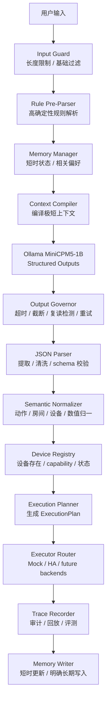
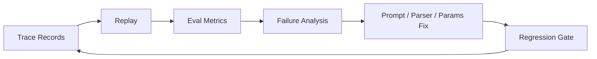
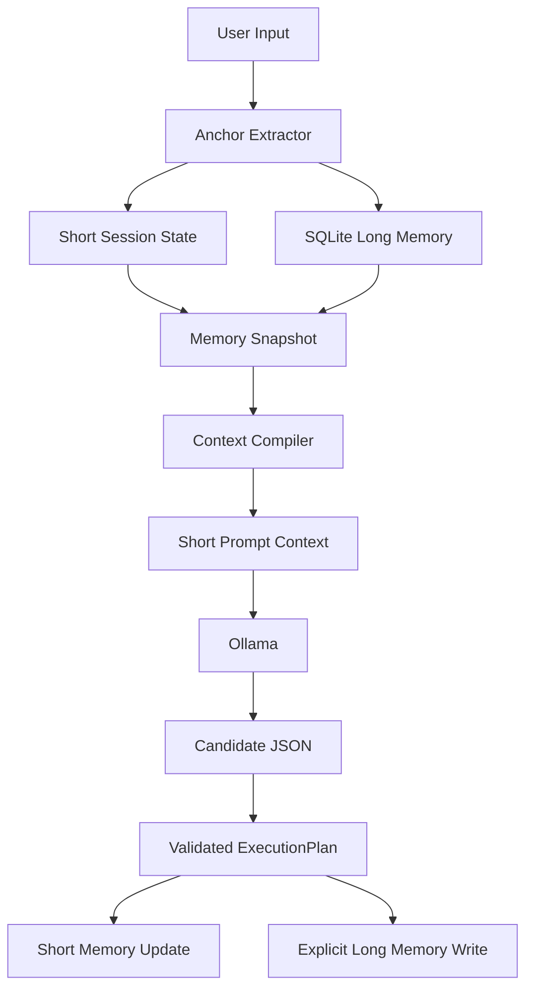

# EdgeHome Harness V2 唯一实施计划

本文档是 EdgeHome Harness 后续实现、重构、验收和 `/goal` 模式执行的唯一规划指标。

最后更新：2026-06-10

## 0. 文档地位

后续任何长任务、`/goal` 模式、代码实现、重构、README 更新、测试补充，都必须优先遵守本文档。

```text
README.md = 项目叙事、架构解释、面试展示入口
plan.md = 唯一执行顺序、验收标准、工程边界
PROJECT_DRAFT_LEGACY.md = 历史草稿和素材库
PROJECT_PLAN_LEGACY_M0_M15.md = 旧版实施计划留档
```

如果实现过程中发现本文档与代码、README 或真实结果冲突，必须先修改 `plan.md`，再继续实现。
不能一边偏离计划，一边继续写代码。

## 1. 本次架构修正结论

旧版计划把 `Evidence-Gated Command Memory` 放在了在线执行主路径里，并要求 `allow / dry_run / execute` 都具备完整证据链。
这个设计更适合企业审批、报销、工单、合同审核等慢速强证据场景，不适合智能家居本地实时控制。

EdgeHome Harness V2 的新结论是：

```text
Runtime Memory 是在线主路径。
Trace / Replay / Eval 是工程观测闭环。
Evidence 不再 gate 用户动作，而是 gate Harness 迭代质量。
```

也就是说：

```text
第一版轻量记忆系统 = 保留并强化
证据门控记忆系统 = 从在线主路径移除
Trace/Evidence = 用于审计回放、评测解释、失败分析、版本回归
```

项目主线从：

```text
Evidence-Gated Command Memory
```

调整为：

```text
Latency-Bounded Edge Agent Harness
低延迟、低内存、强约束、可回放的端侧 Agent Harness
```

更具体的工程口径是：

```text
Memory for runtime.
Evidence for debugging.
Eval for progress.
Policy for deterministic hard constraints.
LLM for candidate JSON only.
```

## 2. 项目最终目标

构建一个面向 1B 端侧小模型的 Rust Agent Harness。
产品形态是智能家居本地控制中台，但项目价值不是替代米家 App 或小米音箱，而是展示：

```text
如何把一个容易复读、死循环、输出不稳定的 1B 本地小模型，
约束成一个可以解析中文 IoT 指令、稳定输出结构化 JSON、
支持短时指代、具备低内存降级、可审计回放、可评测迭代的 Agent Harness。
```

V2 主模型：

```text
openbmb/minicpm5:1b
```

V2 主运行时：

```text
Ollama structured outputs
```

V2 主语言：

```text
Rust
```

V2 主部署约束：

```text
2GB RAM low_memory profile
```

V2 主执行后端：

```text
MockExecutor 默认开启
HomeAssistantExecutor 作为 demo backend
真实设备执行默认关闭
```

V2 对比模型：

```text
Qwen 0.8B / Qwen 1B 只作为 eval 对比模型，不进入主链路。
```

## 3. 不可违反的项目不变量

### 3.1 模型输出永远只是候选

```text
ModelOutput != Command
```

MiniCPM5-1B 只能生成候选 JSON。
任何候选输出必须经过 Harness 校验，不能直接执行。

必经步骤：

```text
raw output
-> output governor
-> JSON extraction
-> schema validation
-> semantic normalization
-> memory resolution
-> device registry validation
-> capability validation
-> execution plan
-> dry-run / executor
-> trace
```

### 3.2 Rust 管业务真相，Ollama 只做候选生成

Ollama 不能维护业务记忆。
不能依赖 Ollama CLI 的交互历史。
不能把长对话塞给小模型。

业务记忆必须由：

```text
Rust + SQLite + 结构化状态
```

管理。

每次请求前，Rust 只给 Ollama 编译一段极短上下文摘要。

### 3.3 证据系统不能阻塞低风险实时路径

V2 不再要求：

```text
allow / dry_run / execute 必须同步完成完整证据链
```

改为：

```text
在线执行必须通过确定性校验。
关键决策必须可 trace。
失败必须可 replay。
版本迭代必须可 eval gate。
```

### 3.4 不让小模型判断风险

1B 小模型不能判断：

```text
某个动作是否高风险
某个设备是否安全
某条记忆是否应该降低策略
某个真实后端是否允许执行
```

这些必须来自：

```text
设备注册表
capability metadata
静态 policy config
用户明确配置
executor 返回状态
```

如果没有真实业务依据，不要在 README 或代码里夸大“高风险智能判断”。

### 3.5 记忆只能补全上下文，不能越权执行

短时记忆可以解析：

```text
再暗一点
再调高一点
把刚才那个关掉
切换成除湿模式
恢复刚才的设置
```

但记忆解析出的目标仍然必须经过：

```text
device registry
capability validation
execution plan
```

长期记忆不能自动降低安全限制。

### 3.6 长期记忆只能由明确表达写入

允许写入：

```text
以后把玄关灯叫小夜灯
以后睡觉模式把卧室灯调到 30%
以后卧室空调默认 26 度
以后门锁操作都要二次确认
```

禁止写入：

```text
一次性设备控制
模型猜测出的偏好
不确定别名
降低安全限制的偏好
高风险自动执行偏好
```

### 3.7 2GB RAM 是硬约束，不是文档口号

V2 不能引入默认重型依赖：

```text
向量数据库
本地 embedding 大模型
长上下文历史
多模型常驻
复杂图数据库
```

默认策略：

```text
短时记忆最多 3 轮
长期偏好最多注入 3 条
记忆摘要 300-500 中文字符以内
低内存时禁用长期记忆注入
输出长度和重试次数都有上限
```

### 3.8 真实设备执行默认关闭

默认只允许：

```text
dry-run
mock execution
eval replay
```

Home Assistant 可以作为 demo backend，但不能在 README 里声称已经完整本地适配所有米家设备。
米家、MIoT、miIO、Matter、MQTT 都只能按真实实现程度描述。

## 4. V2 总体架构

### 4.1 单次请求主链路



### 4.2 Trace/Eval 离线闭环



这条闭环不阻塞普通实时执行。
它用于解释和证明 Harness 变得更稳定。

### 4.3 记忆系统边界



核心原则：

```text
模型不拥有记忆。
模型只看到短摘要。
长期记忆不常驻上下文。
审计失败记录不默认注入 prompt。
```

## 5. 当前已完成基线

M0-M15 已经完成过一版。
后续 `/goal` 不应该无意义重做 M0-M15。
除非测试失败或架构重构需要，否则 M0-M15 只作为基线验收。

当前已具备的模块基线：

```text
edgehome-core
edgehome-config
edgehome-storage
edgehome-trace
edgehome-parser
edgehome-registry
edgehome-gate
edgehome-memory
edgehome-ollama
edgehome-executor
edgehome-eval
edgehome-cli
```

当前已验证能力：

```text
中文智能家居指令解析
规则 parser
短时相对指令解析
MockExecutor
HomeAssistantExecutor demo
eval / replay / trace show
2GB low_memory 文档
MiniCPM5/Ollama 参数文档
```

V2 的任务不是推倒重来，而是在已完成基线上做架构修正和能力升级。

## 6. 后续执行总顺序

后续必须按下面顺序推进：

```text
M16 架构叙事修正
M17 轻量 Runtime Memory v2
M18 Context Compiler 与低内存注入策略
M19 Output Governor v2
M20 TraceFrame 与 Evidence-Backed Replay
M21 Eval Case Matrix 与模型参数评测
M22 Release Gate
M23 Executor Boundary 与设备后端边界
M24 2GB Profile 验证与降级策略
M25 面试 Demo Walkthrough
M26 README / docs 最终同步
M27 可选扩展
```

每个里程碑必须遵守：

```text
先改计划或文档定位，再改代码。
先补测试，再声称能力。
先 Mock / dry-run，再真实 executor。
先 MiniCPM5 主链路，再 Qwen 对比。
每完成一个稳定小阶段就 commit。
```

### 6.1 当前执行状态

截至 2026-06-10，V2 已经进入 M21 收尾阶段。
后续 `/goal` 模式必须从这个状态继续，不要回头重做已经验收并提交的里程碑。

```text
M16 架构叙事修正 = 已完成
M17 轻量 Runtime Memory v2 / alias flow = 已完成
M18 Context Compiler 与低内存注入策略 = 已完成
M19 Output Governor telemetry = 已完成
M20 TraceFrame 与 Evidence-Backed Replay = 已完成
M21 Eval Case Matrix 与模型参数评测 = 已完成
M22 Release Gate = 下一步
M23 Executor Boundary 与设备后端边界 = 待开始
M24 2GB Profile 验证与降级策略 = 待开始
M25 面试 Demo Walkthrough = 待开始
M26 README / docs 最终同步 = 待开始
```

M21 收尾完成后，下一轮 `/goal` 的默认入口是：

```text
M22 Release Gate
```

## 7. M16 架构叙事修正

### 目标

把项目叙事从旧的：

```text
Evidence-Gated Command Memory
```

修正为：

```text
Latency-Bounded Edge Agent Harness
Runtime Memory + Trace Replay Eval
```

### 必须修改

```text
README.md
docs/model-parameters.md
docs/eval-report-example.md
docs/2gb-profile.md
必要时新增 docs/architecture-v2.md
```

### 必须删除或降级的表述

```text
allow / execute 必须有完整证据链
Evidence-Gated Command Memory 是在线主路径
模型或 Harness 能智能判断高风险
证据门控负责普通智能家居动作执行许可
```

### 必须新增的表述

```text
Runtime Memory 是在线主路径
Trace / Replay / Eval 是工程观测闭环
Evidence 用于失败分析、评测解释、版本回归、记忆来源
低风险实时路径不被完整证据链阻塞
小模型只生成候选 JSON
```

### 验收标准

```text
README 第一屏定位不再出现 Evidence-Gated Command Memory 作为核心公式
架构图体现 Runtime Memory 与 Trace/Eval 分离
plan.md 与 README 不冲突
旧版内容已在 legacy 文件中留档
```

### 禁止跑偏

```text
不要把 README 写成智能家居产品营销页
不要夸大米家本地控制能力
不要把证据门控换个名字继续放回在线主路径
```

## 8. M17 轻量 Runtime Memory v2

### 目标

把第一版轻量记忆系统升级为正式主路径。
记忆由 Rust 管，SQLite 存，Ollama 只看短摘要。

### 必须支持的记忆类型

```text
ShortSessionState
LongPreferenceMemory
AliasMemory
SceneMemory
SafetyPreference
FailureAuditMemory
```

注意：

```text
FailureAuditMemory 不默认注入 prompt。
它只用于评测、分析和调优。
```

### ShortSessionState 目标结构

```json
{
  "last_target": {
    "room": "living_room",
    "device_type": "light",
    "device_id": "living_room_main_light"
  },
  "last_action": "set_brightness",
  "last_value": 70
}
```

### 长期记忆写入规则

只有明确表达才写入长期记忆。

触发模式：

```text
以后...
默认...
记住...
把 A 叫做 B
睡觉模式...
```

不写入：

```text
一次性控制
模型推断偏好
模糊表达
降低安全限制
```

### 必须补充的测试

```text
再暗一点 -> 解析 last_target
把刚才那个关掉 -> 解析 last_target
以后把玄关灯叫小夜灯 -> 写入 alias memory
打开小夜灯 -> 使用 alias memory
一次性打开卧室灯 -> 不写长期记忆
以后门锁都自动打开 -> 拒绝写入降低安全的长期记忆
```

### 验收标准

```text
短时记忆最多 3 轮
长期偏好最多注入 3 条
低内存模式可禁用长期注入
记忆写入必须带 source_trace_id 或 source_event_id
模型不接触 SQLite 原始内容
```

## 9. M18 Context Compiler 与低内存注入策略

### 目标

实现一个明确的上下文编译器，把结构化记忆压缩成短摘要。
这段摘要每次请求临时生成，不能无限增长。

### 输入

```text
当前用户输入
ShortSessionState
相关 LongPreferenceMemory
相关 AliasMemory
设备候选摘要
low_memory profile
```

### 输出

```text
MemoryContextBlock
```

示例：

```text
当前会话摘要：
- 上一次目标设备：living_room_main_light
- 上一次动作：set_brightness
- 上一次亮度：70

相关偏好：
- 卧室空调默认温度：26
- 小夜灯 = hallway_light
```

### 预算

默认：

```text
300-500 中文字符
最多 3 条长期偏好
最多 1 个 last_target
最多 1 个 last_action
```

低内存：

```text
禁用长期偏好注入
只保留 last_target
必要时完全关闭记忆注入
```

### 验收标准

```text
ContextCompiler 有单元测试
超过预算会裁剪
裁剪结果稳定可预测
低内存 profile 会改变注入策略
README 文档解释为什么不使用长历史
```

## 10. M19 Output Governor v2

### 目标

针对 1B 小模型的死循环、复读、超长输出、解释文本混入，建立可观测、可重试、可降级的输出治理层。

### 必须实现或确认

```text
num_predict 上限
请求超时
最大重试次数
重复片段检测
JSON 提取失败分类
schema 失败分类
fallback reason
```

### 重试策略

第一次：

```text
正常 structured output prompt
```

第二次：

```text
更短 prompt
更低温度
更严格 JSON only 指令
```

最终失败：

```text
返回 need_clarification 或 parse_failed
写入 trace
不能编造命令执行
```

### 必须记录的指标

```text
attempt_count
raw_output_length
json_extract_status
schema_status
repeat_detected
timeout
fallback_used
latency_ms
```

### 验收标准

```text
死循环样本不会卡死 CLI
失败能落 trace
重试次数有硬上限
eval report 能看到 retry_rate 和 failure_reason
```

## 11. M20 TraceFrame 与 Evidence-Backed Replay

### 目标

把旧 Evidence Store 从在线门控角色调整为 TraceFrame。
TraceFrame 用于复盘、评测解释、失败分析、模型参数比较。

### TraceFrame 必须包含

```text
trace_id
timestamp
input_text
model_name
model_params
runtime_profile
memory_snapshot_summary
prompt_hash
raw_model_output
cleaned_json
schema_result
normalized_command
device_resolution
capability_result
execution_plan
executor_result
failure_reason
latency_ms
memory_pressure
retry_count
```

### 不再要求

```text
普通 allow / dry-run / execute 同步等待完整证据链
```

### 必须支持

```text
trace show
trace export
replay trace
eval from traces
failure classification
```

### 验收标准

```text
任意失败 case 可以通过 trace_id 复盘
trace 中能看到模型原始输出和 Harness 处理结果
trace 不泄露 token、设备密钥、真实后端凭据
```

## 12. M21 Eval Case Matrix 与模型参数评测

### 目标

建立面向 1B 小模型 Harness 的评测矩阵。
评测重点不是开放聊天质量，而是智能家居窄场景的结构化稳定性。

### 必须覆盖的 case 类型

```text
intent classification
slot extraction
relative command
alias memory
scene preference
invalid JSON recovery
dead loop recovery
unknown device
unsupported capability
low_memory degradation
HomeAssistant dry-run planning
```

### 必须输出的指标

```text
intent_accuracy
slot_accuracy
schema_valid_rate
retry_rate
fallback_rate
dead_loop_rate
trace_coverage
memory_resolution_accuracy
latency_avg_ms
latency_p95_ms
low_memory_degrade_count
```

### 模型参数比较

至少支持比较：

```text
MiniCPM5-1B stable profile
MiniCPM5-1B faster profile
Qwen 0.8B comparison profile
```

注意：

```text
Qwen 对比只用于说明小模型差异和 Harness 价值。
不能把 Qwen 作为 V2 主链路。
```

### 验收标准

```text
cases/zh-home.yaml 扩展到覆盖多轮、别名、失败恢复
eval report 可导出 JSON 或 Markdown
README 有一组可复现指标示例
指标必须来自本地实际 eval，不能编造
```

## 13. M22 Release Gate

### 目标

把证据系统真正用在工程质量门禁上。
不是 gate 用户执行，而是 gate 项目迭代。

### CLI 目标

可以实现或规划：

```text
edgehome eval cases/zh-home.yaml --gate
edgehome replay --gate traces/*.jsonl
```

### 默认 gate 标准

```text
schema_valid_rate = 1.0
dead_loop_rate = 0.0
trace_coverage = 1.0
intent_accuracy >= 0.95
slot_accuracy >= 0.90
retry_rate <= 0.30
```

低内存 profile gate：

```text
不会 panic
不会无限重试
不会无限上下文增长
可以禁用长期记忆注入
```

### 验收标准

```text
gate 失败时 CLI exit code 非 0
gate 报告说明失败 case
README 解释 Evidence-Gated Release 的意义
```

## 14. M23 Executor Boundary 与设备后端边界

### 目标

保持执行层清晰，避免项目变成“假装全量米家控制”的产品。

### 必须明确

```text
MockExecutor 是默认执行路径
HomeAssistantExecutor 是 demo backend
真实设备执行默认关闭
未来可扩展 MIoT / miIO / MQTT / Matter
```

### Executor 只能接受

```text
ExecutionPlan
```

禁止接受：

```text
用户原始输入
模型原始输出
未经 schema 校验的 JSON
未经设备注册表确认的 command
```

### 验收标准

```text
README 不夸大米家适配
docs/deployment-modes.md 说明 HA demo 边界
真实执行需要显式配置开关
eval 不依赖真实设备
```

## 15. M24 2GB Profile 验证与降级策略

### 目标

把 2GB RAM 约束从文档叙事变成实际策略。

### 必须确认

```text
low_memory profile 配置
num_ctx 限制
num_predict 限制
memory context budget
retry limit
long memory injection disable
trace write 不阻塞主路径过久
```

### 降级策略

```text
内存压力正常：短时记忆 + 少量长期偏好
内存压力中等：短时记忆 + 禁用长期偏好
内存压力高：只保留 last_target
内存压力严重：关闭记忆注入，单轮解析
```

### 验收标准

```text
docs/2gb-profile.md 与代码配置一致
eval 能指定 low_memory profile
低内存模式下不会无限膨胀上下文
```

## 16. M25 面试 Demo Walkthrough

### 目标

形成一套可以给面试官演示的命令脚本和叙事路径。

### 必须包含的 demo

```text
1. 普通指令：把客厅灯关掉
2. 槽位抽取：晚上十点后把走廊灯调到 30%
3. 短时记忆：把卧室灯调到 70%，再暗一点
4. 长期别名：以后把玄关灯叫小夜灯，打开小夜灯
5. 小模型失败恢复：坏 JSON / 死循环 / retry / fallback
6. 低内存降级：禁用长期偏好注入
7. trace replay：复盘一次失败
8. eval gate：展示版本是否通过
```

### Demo 原则

```text
优先 dry-run
不依赖真实设备
输出必须稳定
每个 demo 都能说明一个 Harness 能力
```

### 验收标准

```text
scripts/demo.ps1 可运行
docs/demo-walkthrough.md 解释每一步
README 有快速复现命令
```

## 17. M26 README / docs 最终同步

### 目标

把 README 写成面试项目说明书，而不是零散笔记。

### README 必须回答

```text
这个项目是什么
为什么 1B 小模型需要 Harness
为什么 Ollama JSON 约束不够
Runtime Memory 怎么工作
Output Governor 怎么处理死循环
Trace/Replay/Eval 怎么形成工程闭环
2GB RAM 下如何降级
智能家居只是产品形态，不是项目全部
真实设备执行边界在哪里
```

### README 必须包含的图

```text
总体架构图
单次请求链路图
记忆系统图
Trace/Eval 闭环图
Executor 边界图
```

### 禁止

```text
不要把 README 写成营销页
不要堆砌空泛 AI 概念
不要再把 Evidence-Gated Command Memory 放在核心公式
不要声称已经完整适配所有米家设备
```

### 验收标准

```text
README 与 plan.md 一致
docs 与 README 不互相冲突
README 中的命令可运行
README 中的指标有来源
```

## 18. M27 可选扩展

以下内容可以作为后续加分项，但不能阻塞 V2 主线。

```text
Qwen 0.8B / 1B 更完整对比
MIoT / miIO local adapter
MQTT / Matter backend
HTTP daemon mode
Web dashboard
trace 可视化
SQLite FTS5 记忆检索
更细的参数自动搜索
```

限制：

```text
没有真实实现前不要写成已完成能力
不要为了扩展破坏 2GB low_memory 主线
不要引入重型依赖作为默认路径
```

## 19. 每轮开发固定流程

每次 `/goal` 或长任务必须按这个流程：

```text
1. 读 plan.md 当前里程碑
2. 读相关 README/docs
3. 读相关 crate 代码
4. 更新 plan.md 状态或补充细节
5. 小步实现
6. cargo fmt --all --check
7. cargo check
8. cargo test
9. eval cases/zh-home.yaml
10. 更新 README/docs
11. git status
12. git add
13. git commit
14. 必要时 git push
```

如果某一步无法执行，必须在最终回答里说明原因。

## 20. 常用验证命令

由于项目路径包含中文，Windows 下建议使用：

```powershell
$env:CARGO_TARGET_DIR="$env:TEMP\edgehome-target"
```

基础验证：

```powershell
cargo fmt --all --check
cargo check
cargo test
cargo run -q -p edgehome-cli -- --db-path edgehome-eval.sqlite eval cases/zh-home.yaml
```

Demo：

```powershell
powershell -ExecutionPolicy Bypass -File scripts\demo.ps1 -DatabasePath edgehome-demo.sqlite
```

Git 留档：

```powershell
git status --short
git add .
git commit -m "docs: update v2 implementation plan"
git push
```

## 21. 提交留档规则

用户明确要求经常提交留档。

必须提交的节点：

```text
完成一个 milestone
完成一组可运行测试
完成 README/plan 重大修改
完成架构方向修正
修复一个会影响 demo 的 bug
```

提交信息建议：

```text
docs: reframe harness architecture
feat: add runtime memory compiler
feat: add output governor telemetry
feat: add trace replay gate
test: expand home command eval cases
fix: resolve relative command memory
```

禁止：

```text
把大量无关改动混在一个 commit
在测试明显失败时提交为完成态
删除历史材料而不留档
```

## 22. 成功标准

V2 完成时，项目应该能清楚证明：

```text
1. 1B 小模型只负责候选 JSON，不负责业务真相。
2. Rust Harness 能约束小模型输出，防止死循环和坏 JSON 拖垮系统。
3. 短时记忆和长期偏好由 Rust + SQLite 管理，不依赖 Ollama 历史。
4. 2GB RAM 下有明确的上下文预算、重试预算和记忆降级策略。
5. 智能家居动作必须经过设备注册表、capability 和执行计划。
6. Trace/Replay/Eval 能复盘失败、比较模型参数、阻止回归。
7. README 能让面试官理解这是 Agent Harness 工程，不是简单 IoT 脚本。
```

最终一句话：

```text
EdgeHome Harness V2 是一个面向 1B 端侧小模型的 Rust Agent Harness。
它用智能家居本地控制作为产品场景，用 Runtime Memory 解决实时上下文，
用 Output Governor 解决小模型死循环和坏输出，
用 Trace/Replay/Eval 解决失败复盘和版本回归，
并在 2GB RAM 约束下保持可部署、可演示、可解释。
```
